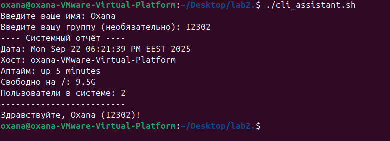
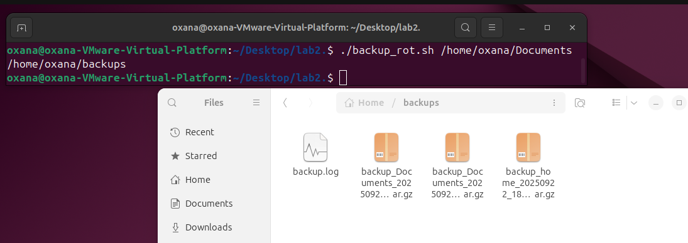
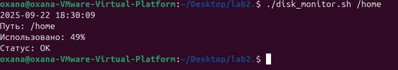

# Bash Projects
**Выполнила:** Godoroja Oxana, I2302 

# Задание 1

## «CLI‑ассистент: приветствие, валидация»

### Цель

Освоить ввод/вывод, переменные, условия, простые циклы, подстановку команд.

### Что нужно было сделать

Написать скрипт `cli_assistant.sh`, который:

1. Спрашивает имя пользователя и (необязательно) его отдел/группу
2. Валидирует ввод (пустые значения — повторный запрос до 3 попыток).
3. Выводит мини‑отчёт:
    - текущая дата,
    - имя хоста,
    - время аптайма,
    - свободное место на `/`,
    - количество пользователей, вошедших в систему.
4. Итоговая строка: «Здравствуйте, <Имя> (<Отдел|не указан>)!».

### Требования

- Shebang `#!/bin/bash`.
- Валидация пустого ввода с максимум 3 попытками (после — вежливый выход с кодом `1`).
- Использование командной подстановки `$(...)`.
- Только стандартные утилиты.

---

```bash
#!/bin/bash

ask_input() {
    local prompt="$1"
    local input=""
    local tries=0

    while [ $tries -lt 3 ]; do
        read -p "$prompt" input
        if [ -n "$input" ]; then
            echo "$input"
            return 0
        fi
        echo "Поле не может быть пустым. Попробуйте снова."
        ((tries++))
    done
    echo "Слишком много неудачных попыток. Выход."
    exit 1
}

name=$(ask_input "Введите ваше имя: ")
read -p "Введите вашу группу (необязательно): " dept

echo "---- Системный отчёт ----"
echo "Дата: $(date)"
echo "Хост: $(hostname)"
echo "Аптайм: $(uptime -p)"
echo "Свободно на /: $(df -h / | awk 'NR==2{print $4}')"
echo "Пользователи в системе: $(who | wc -l)"
echo "-------------------------"

if [ -z "$dept" ]; then
    dept="не указан"
fi
echo "Здравствуйте, $name ($dept)!"

```



---

# Задание 2

## «Резервное копирование каталога с логированием и ротацией»

### Цель

Отработать аргументы скрипта, работу с файлами/путями, условия, архивирование, коды возврата и логирование.

### Что нужно было сделать

Написать скрипт `backup_rot.sh`, который:

- Принимает аргументы:
    1. Обязательный путь к каталогу‑источнику (например, `/home/student/data`).
    2. Необязательный путь к каталогу для бэкапов (по умолчанию `~/backups`).
        
- Проверяет, что источник существует и это каталог; создаёт каталог бэкапов при необходимости.
- Создаёт архив `tar.gz` с именем по шаблону:  
    `backup_<basename источника>_<YYYYMMDD_HHMMSS>.tar.gz`
- Пишет лог в `backup.log` в каталоге бэкапов (время, имя архива, размер, код возврата).
- Возвращает код `0` при успехе, `≠0` при ошибках ввода/архивации.

### Примеры

```shell
$ ./backup_rot.sh 
~/projects/app 
$ ./backup_rot.sh /var/www /mnt/storage/backups 5
```


### Требования
- Защита от пробелов в путях (кавычки при `tar`, `mv`, `rm`).
- Проверка доступности записи в каталог бэкапов.


```shell
#!/bin/bash

SRC="$1"
DST="${2:-$HOME/backups}"

if [ -z "$SRC" ] || [ ! -d "$SRC" ]; then
    echo "Ошибка: укажите существующий путь"
    exit 1
fi

mkdir -p "$DST" || { echo "Нет доступа для записи в $DST"; exit 1; }

TS=$(date +%Y%m%d_%H%M%S)
BASE=$(basename "$SRC")
ARCHIVE="backup_${BASE}_${TS}.tar.gz"

tar -czf "$DST/$ARCHIVE" -C "$(dirname "$SRC")" "$BASE"
STATUS=$?

SIZE=$(du -h "$DST/$ARCHIVE" | cut -f1)

echo "$(date +%Y-%m-%dT%H:%M:%S) SRC=$SRC DST=$DST FILE=$ARCHIVE SIZE=$SIZE STATUS=$STATUS" >> "$DST/backup.log"

exit $STATUS
```


# Задание 3
## «Мониторинг дискового пространства»

### Цель

Закрепить циклы, условия, работу с системными командами (`df`, `awk`), аргументы и коды возврата.

### Что нужно было сделать

Написать скрипт `disk_monitor.sh`, который:

1. Принимает аргументы:
    - путь к файловой системе (например, `/` или `/home`),
    - необязательный порог заполнения (%) — по умолчанию 80.
2. Проверяет, что путь существует.
3. С помощью `df -h` получает процент использования.
4. Выводит:
    - текущую дату/время,
    - путь и процент занятости,
    - сообщение «OK» если меньше порога, иначе «WARNING: диск почти заполнен!».
5. Возвращает код:
    - `0`, если всё в норме,
    - `1`, если превышен порог,
    - `2`, если ошибка (например, путь не найден).

```shell
#!/bin/bash

PATH_FS="$1"
THRESHOLD="${2:-80}"

if [ -z "$PATH_FS" ] || [ ! -d "$PATH_FS" ]; then
    echo "Ошибка: путь не найден"
    exit 2
fi

USAGE=$(df -h "$PATH_FS" | awk 'NR==2{print $5}' | tr -d '%')

echo "$(date '+%Y-%m-%d %H:%M:%S')"
echo "Путь: $PATH_FS"
echo "Использовано: ${USAGE}%"

if [ "$USAGE" -lt "$THRESHOLD" ]; then
    echo "Статус: OK"
    exit 0
else
    echo "WARNING: диск почти заполнен!"
    exit 1
fi

```



## cli_assistant.sh
Ассистент, который спрашивает имя и отдел, валидирует ввод и выводит отчёт о системе.

Запуск:
```bash
./cli_assistant.sh
```

## backup_rot.sh
Делает архив указанной папки и сохраняет в директорию бэкапов, пишет лог.

Пример:
```bash
./backup_rot.sh ~/projects
```

## disk_monitor.sh
Мониторит заполнение диска и выдаёт статус.

Пример:
```bash
./disk_monitor.sh / 75
```

---

Впервую очередь все скрипты нужно сделать исполняемыми:
```bash
chmod +x *.sh
```
