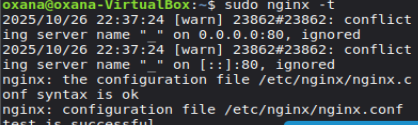
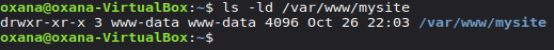
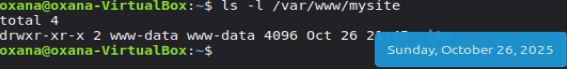
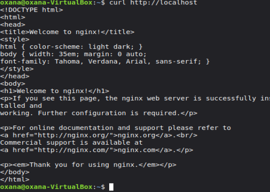
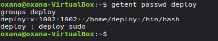
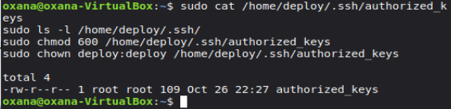
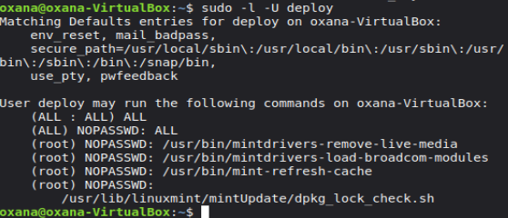

# Лабораторная работа: Развёртывание статического сайта и создание пользователя deploy через Ansible

**Студент:** Оксана Годорожа  
**Группа:** I2302  
**Дата:** 26.10.2025

---

## Плейбук 1: Статический сайт через Nginx + распаковка архива

**Цель:**
- Установить Nginx
- Развернуть мини-сайт из архива `site.tar.gz`
- Настроить виртуальный хост

**Структура проекта и файлы:**

```
ansible_project/
│
├── playbooks/
│   └── 01_static_site.yml         # Playbook для развертывания статического сайта
├── files/
│   ├── site.tar.gz                # Архив с index.html и статиками
│   └── mysite.conf                # Конфигурация виртуального хоста Nginx
├── inventory                      # Файл с описанием хостов

```

### Шаг 1. Установка и запуск Nginx

```bash
sudo apt update
sudo apt install nginx -y
sudo systemctl enable nginx
sudo systemctl start nginx
sudo systemctl status nginx
```

**Проверка синтаксиса конфигурации:**

```bash
sudo nginx -t
```


**Вывод:** Nginx установлен и сервис активен.

---

### Шаг 2. Создание каталога для сайта

```bash
sudo mkdir -p /var/www/mysite
sudo chown www-data:www-data /var/www/mysite
sudo chmod 755 /var/www/mysite
```

**Проверка:**

```bash
ls -ld /var/www/mysite
```

---

### Шаг 3. Распаковка архива сайта

```bash
sudo tar -xzf ~/ansible_project/files/site.tar.gz -C /var/www/mysite
```


**Проверка содержимого:**

```bash
ls -l /var/www/mysite
```

- Файл `index.html` и статика на месте.

---

### Шаг 4. Настройка виртуального хоста

Файл `/etc/nginx/sites-available/mysite.conf`:

```conf
server {
    listen 80;
    listen [::]:80;

    server_name _;

    root /var/www/mysite;
    index index.html;

    access_log /var/log/nginx/mysite_access.log;
    error_log  /var/log/nginx/mysite_error.log;

    location / {
        try_files $uri $uri/ =404;
    }
}
```

Активируем сайт:

```bash
sudo ln -s /etc/nginx/sites-available/mysite.conf /etc/nginx/sites-enabled/
sudo nginx -t
sudo systemctl restart nginx
```

**Проверка работы сайта:**

```bash
curl http://localhost
```


- Содержимое `index.html` отображается, ошибок 404 нет.

---

## Плейбук 2: Пользователь deploy + SSH-ключ + sudoers drop-in

**Цель:**
- Создать пользователя `deploy`
- Настроить SSH-доступ через ключ
- Настроить sudo без пароля

---

### Шаг 1. Создание пользователя и добавление в sudo

```bash
sudo useradd -m -s /bin/bash deploy
sudo usermod -aG sudo deploy
```

**Проверка:**

```bash
getent passwd deploy
groups deploy
```


**Вывод:**

```
deploy:x:1002:1002::/home/deploy:/bin/bash
deploy : deploy sudo
```

---

### Шаг 2. Настройка SSH-доступа

```bash
sudo mkdir -p /home/deploy/.ssh
sudo chmod 700 /home/deploy/.ssh
sudo chown deploy:deploy /home/deploy/.ssh

# Добавляем публичный ключ
sudo nano /home/deploy/.ssh/authorized_keys
# вставляем публичный ключ

sudo chmod 600 /home/deploy/.ssh/authorized_keys
sudo chown deploy:deploy /home/deploy/.ssh/authorized_keys
```

**Проверка:**

```bash
sudo cat /home/deploy/.ssh/authorized_keys
sudo ls -l /home/deploy/.ssh/
```

- Публичный ключ установлен, права корректны.

---

### Шаг 3. Настройка sudo без пароля

```bash
echo "deploy ALL=(ALL) NOPASSWD:ALL" | sudo tee /etc/sudoers.d/deploy
sudo chmod 440 /etc/sudoers.d/deploy
sudo visudo -cf /etc/sudoers.d/deploy
```

**Вывод:**

```
/etc/sudoers.d/deploy: parsed OK
```

**Проверка sudo для пользователя deploy:**

```bash
sudo -l -U deploy
```

Вывод:

```
User deploy may run the following commands on oxana-VirtualBox:
    (ALL : ALL) ALL
    (ALL) NOPASSWD: ALL
```

- sudo без пароля работает корректно.

---


**Вывод:**
- Все цели лабораторной работы достигнуты.
- Сервисы, пользователи и Docker-файлы настроены корректно.

