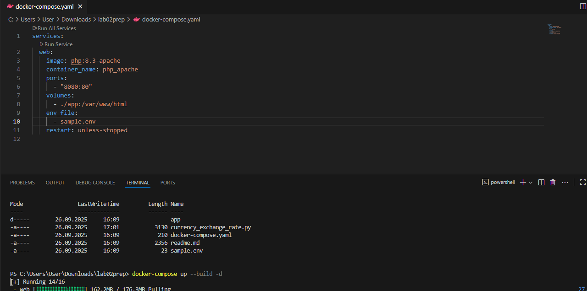
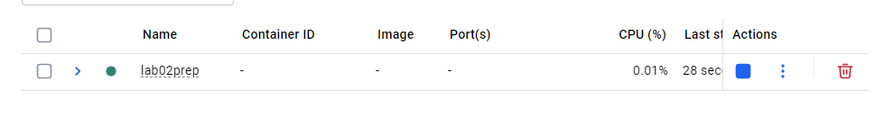
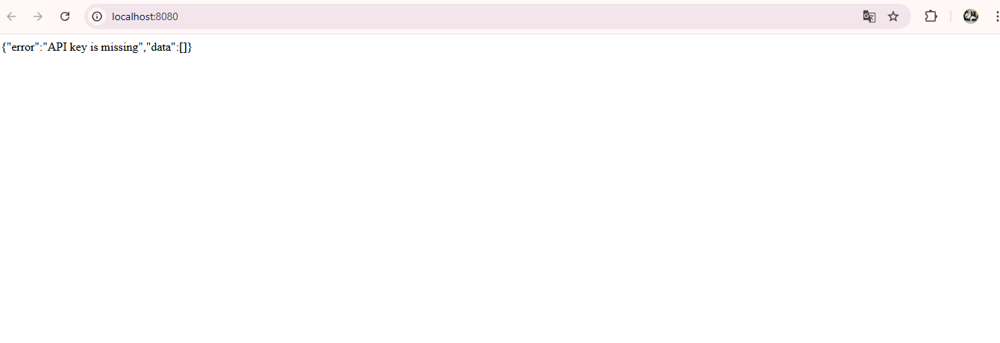
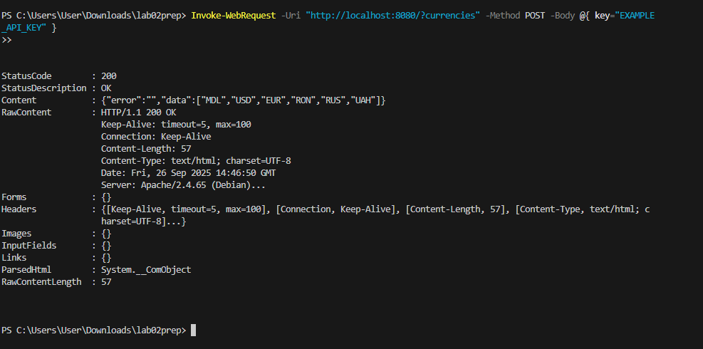
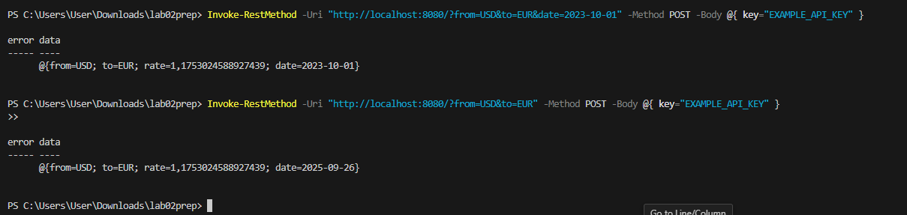

# IW02: Creating a Python Script to Interact with an API

## Author: Godoroja Oxana, I2302

--- 

It is a  project for `IW02: Creating a Python Script to Interact with an API` and represents a Currency Exchange Rate service. The default currency is `MDL` (Moldovan Leu) and the service provides exchange rates for `USD`, `EUR`, `RON`, `RUS` and `UAH`.

Project contains the following files and directories:

- `app/` - directory containing the main application code;
  - `index.php` - main application file;
- `data.json` - JSON file with sample exchange rates data;
- `sample.env` - Environment variables file for the application;
- `docker-compose.yml` - Docker Compose file for setting up the application and its dependencies.

Project contains valid currency rates data from `2025-01-01` to `2025-09-15`.

---

## How to run

1. Make sure you have Docker and Docker Compose installed on your machine.
2. Clone this repository to your local machine.
3. Navigate to the project directory.
4. Create a `.env` file by copying the `sample.env` file and set your desired API key or if you want to use a custom name for the env file, you need to specify it in the docker-compose.yml.

   ```bash
   cp sample.env .env
   ```
   


5. Run the following command to build and start the application:

   ```bash
   docker-compose up --build
   ```
   

6. The application will be accessible at `http://localhost:8080`.

   

---

## How to use

### List of currencies

You can obtain the list of available currencies by sending a GET request to the `/?currencies` endpoint:

```bash
curl "http://localhost:8080/?currencies" -X POST -d "key=EXAMPLE_API_KEY"
```

Or for Windows

```powershell
Invoke-RestMethod -Uri "http://localhost:8080/?currencies" -Method POST -Body @{ key="EXAMPLE_API_KEY" }
```



#### Example response, list of currencies

```json
{"error":"","data":["MDL","USD","EUR","RON","RUS","UAH"]}
```

--- 

### Currency exchange rate

You can access the currency exchange service by sending a GET request to the `/` endpoint with the following query parameters:

- `from` (GET) - the currency you want to convert from (e.g., `USD`, `EUR`,);
- `to` (GET) - the currency you want to convert to (e.g., `USD`, `EUR`);
- `date` (GET) - (optional) the date for which you want the exchange rate in `YYYY-MM-DD` format. If not provided, the latest rates will be used;
- `key` (POST) - API key for authentication.

```bash
curl "http://localhost:8080/?from=USD&to=EUR&date=2023-10-01" -X POST -d "key=EXAMPLE_API_KEY"
```
Or for Windows

```powershell
 Invoke-RestMethod -Uri "http://localhost:8080/?from=USD&to=EUR&date=2023-10-01" -Method POST -Body @{ key="EXAMPLE_API_KEY" }
```




#### Example response, currency exchange rate

```json
{"error":"","data":{"from":"USD","to":"EUR","rate":1.1753024588927439,"date":"2023-10-01"}}
```
