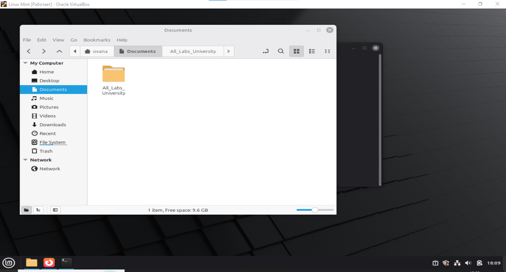
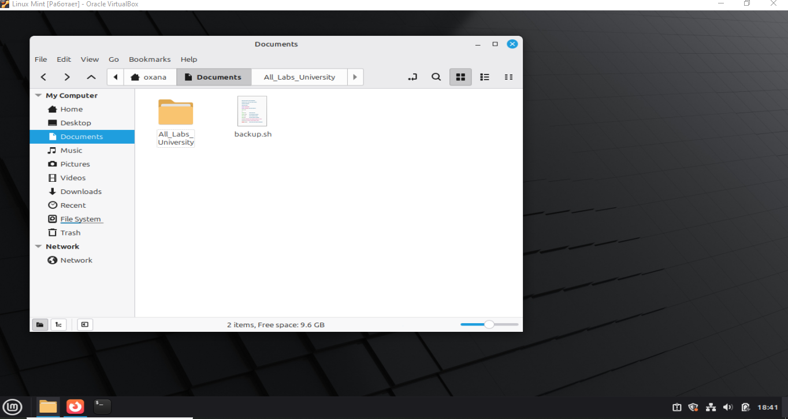
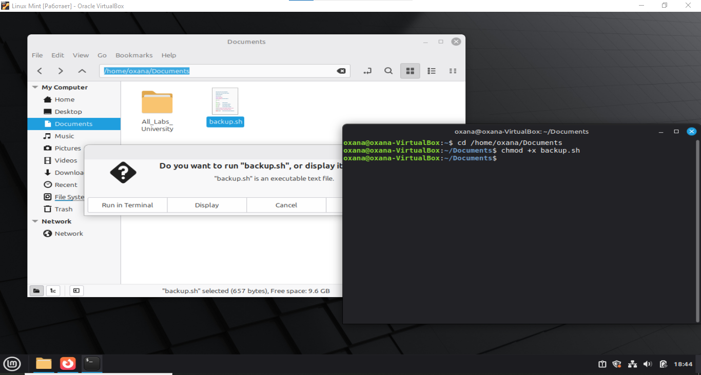
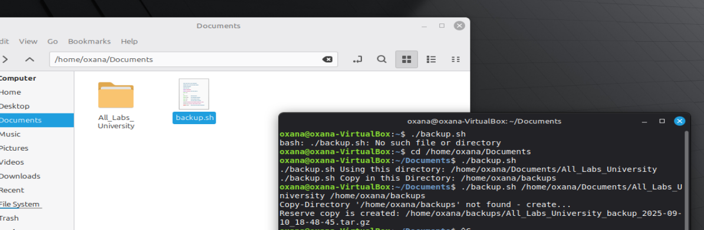
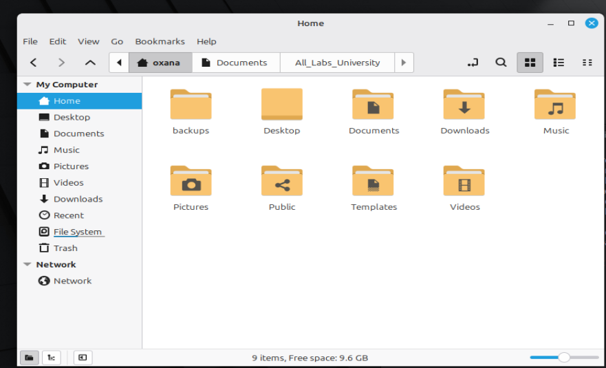
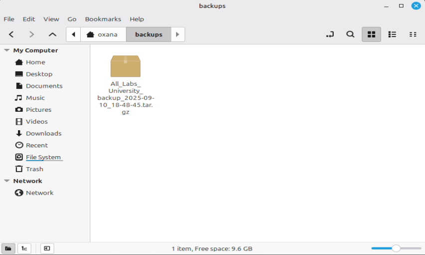

# Laboratory Work №1: - Backup Script (`backup.sh`)
## Performed by: Godoroja Oxana, Group I2302
## Date: September 10, 2025

## Objective
Learn to create and execute simple Shell scripts to automate routine tasks in the Linux operating system. This script automates the process of creating a backup of an important directory.

---

## Script Description
`backup.sh` creates a compressed backup (`tar.gz`) of a specified directory. The script ensures that the source and destination directories exist and generates a backup file with the current date in its filename.

---

## Features
- Accepts two arguments:
  1. **Source directory**: Path to the directory to back up.
  2. **Destination directory** *(optional)*: Path to save the backup. Defaults to `/backup`.
- Creates a `.tar.gz` archive with the current date in the filename.
- Checks if the specified directories exist and outputs appropriate error messages.

---

## Usage
```bash
./backup.sh /path/to/source /path/to/destination
```

- **Example with default destination:**
```bash
./backup.sh /home/user/Documents
```
Backup will be saved in `/backup`.

- **Example with custom destination:**
```bash
./backup.sh /home/user/Documents /home/user/backups
```

---

## Script Behavior
1. **Directory Validation:**  
   - Checks if the source directory exists.  
   - Checks if the destination directory exists.  
   - Outputs an error message if validation fails.

2. **Backup Creation:**  
   - Compresses the source directory into a `.tar.gz` archive.  
   - Includes the current date in the filename (e.g., `backup_2025-09-10.tar.gz`).

3. **Completion Message:**  
   - Confirms successful creation of the backup file.

---

## Requirements
- Linux operating system
- Bash shell
- `tar` utility installed

---

## Notes
- Ensure you have the necessary permissions to read the source directory and write to the destination directory.
- The script is safe to run multiple times; it generates a new backup file for each execution.

---

## Steps Performed

### 1. Creating/Editing the Script
```bash
nano backup.sh
```

- You can write the script logic and save it here.
  


---

```bash
#!/usr/bin/env bash 
set -euo pipefail

usage(){
echo " $0 Using this directory: /home/oxana/Documents/All_Labs_University"
echo "$0 Copy in this Directory: /home/oxana/backups"
exit 1
}

if [ $# -lt 1]; then usge;fi

SRC="$1"
DEST="${2:-/backup}"

if [! -d "$SRC"]; then 
echo "Mistake: directory '$SRC'  not found." >&2
exit2
fi

if[ ! -d "$DEST"]; then
echo "Copy-Directory  '$DEST' not found - create..."
mkdir -p "$DEST"
fi 

DATE_STR="$(date +%F_%H-%M-%S)"
BASE="$(basename "$SRC")"
ARCHIVE="${DEST}/${BASE}_backup_${DATE_STR}.tar.gz"

tar -czf "$ARCHIVE" -C "$(dirname "$SRC")" "$BASE"

echo "Rezerv oopy is create: $ARCHIVE"
```
---

### 2. Making the Script Executable
```bash
chmod +x backup.sh
```
- `chmod` changes file permissions.
- `+x` makes the file executable, allowing it to be run as a program.
- 

### 3. Running the Script with Default Destination
```bash
./backup.sh /home/user/Documents
```
- `./backup.sh` runs the script in the current directory.
- `/home/user/Documents` is the source directory to back up.
- Since no destination is provided, the script uses `/backup` by default.

### 4. Running the Script with Custom Destination
```bash
./backup.sh /home/user/Documents /home/user/backups
```
- Runs the script with a specific backup destination `/home/user/backups`.
- The backup will be stored in this directory instead of `/backup`.
- 

### 5. Checking Contents of Backup Archive
```bash
tar -tzf /backup/backup_2025-09-10.tar.gz
```
- `tar` is used for creating and manipulating archives.
- `-t` lists contents of the archive.
- `-z` tells tar the archive is compressed with gzip.
- `-f` specifies the archive file name.
- This command lets you verify that all files were correctly backed up.
- 
- 

### 6. Optional: Removing Old Backups
```bash
rm /backup/backup_2025-09-01.tar.gz
```
- `rm` deletes a file.
- Use with caution; permanently removes old backup files.

---
## Conclusions

1. The backup script `backup.sh` successfully automates the process of creating compressed backups of directories in Linux.
2. Learned how to handle command-line arguments, including optional parameters.
3. Practiced validating directories and handling errors in Bash scripts.
4. Gained experience with dynamic filenames using date variables to prevent overwriting previous backups.
5. Understood how to use key Linux commands like `tar`, `chmod`, and `rm` safely and effectively.

## Bibliography

1. GNU Bash Reference Manual. Free Software Foundation. [https://www.gnu.org/software/bash/manual/bash.html](https://www.gnu.org/software/bash/manual/bash.html)
2. GNU tar Manual. Free Software Foundation. [https://www.gnu.org/software/tar/manual/](https://www.gnu.org/software/tar/manual/)
3. Linux Command Line and Shell Scripting Bible, 4th Edition, Richard Blum, Christine Bresnahan, Wiley, 2020.
4. Linux Documentation Project. [https://tldp.org/](https://tldp.org/)
5. TutorialsPoint Bash Scripting Guide. [https://www.tutorialspoint.com/unix/shell_scripting.htm](https://www.tutorialspoint.com/unix/shell_scripting.htm)
