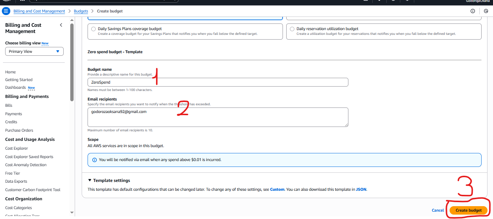
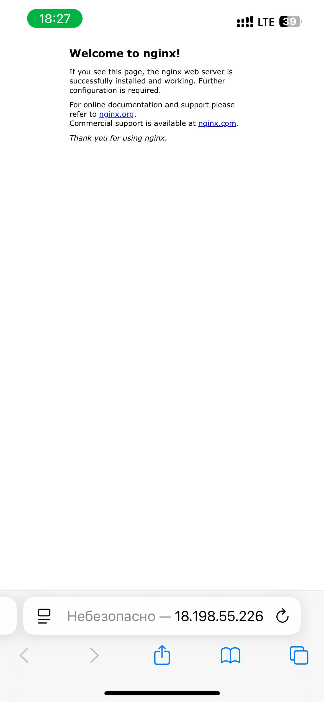

# Лабораторная работа №2. Введение в AWS. Вычислительные сервисы

## Описание лабораторной работы

В рамках данной лабораторной работы я познакомилась с основными вычислительными сервисами AWS, научилась создавать и настраивать виртуальные машины (EC2), а также развёртывать простые веб-приложения.

## Постановка задачи

**Цель работы:** Изучить основные вычислительные сервисы AWS, освоить создание и настройку виртуальных машин EC2, развернуть веб-приложение на облачной инфраструктуре.

**Основные этапы работы:**
- Регистрация в AWS и настройка бесплатного аккаунта
- Создание IAM группы и пользователя для безопасного управления доступом
- Настройка бюджета для контроля расходов
- Создание и запуск EC2 инстанса
- Настройка логирования и мониторинга
- Подключение к виртуальной машине по SSH
- Развёртывание веб-приложения
- Завершение работы и удаление ресурсов

---

## Практическая часть

### Задание 0. Подготовка среды

Я перешла на официальный сайт AWS (https://aws.amazon.com/) и зарегистрировала бесплатный аккаунт Free Tier, следуя инструкциям на сайте.

После успешной регистрации я вошла в консоль управления AWS под root-пользователем. В правом верхнем углу консоли я выбрала регион **EU (Frankfurt) eu-central-1**, так как это один из ближайших к нам регионов.


---


---


---


---


---

### Задание 1. Создание IAM группы и пользователя

**IAM (Identity and Access Management)** — это сервис для управления доступом в AWS, который позволяет создавать пользователей, группы и политики безопасности.

#### Создание IAM группы

Я открыла сервис IAM через консоль управления AWS и выполнила следующие шаги:

1. Перешла в раздел **"Groups"** и нажала **"Create New Group"**
2. Ввела имя группы **"Admins"** и нажала **"Next Step"**
3. На шаге **"Attach Policy"** выбрала политику **AdministratorAccess**
4. Завершила создание группы


---


---


---


**Ответ на контрольный вопрос:** Политика **AdministratorAccess** предоставляет полный доступ ко всем сервисам и ресурсам AWS. Это самая привилегированная политика, которая позволяет выполнять любые операции в аккаунте AWS, включая создание и удаление ресурсов, управление пользователями и настройку биллинга.

#### Создание IAM пользователя

Далее я создала нового IAM пользователя:

1. Перешла в раздел **"Users"** и нажала **"Add user"**
2. Ввела имя пользователя **"cloudstudent"**
3. Привязала пользователя к группе **"Admins"**
4. Разрешила пользователю доступ к AWS Management Console
5. Убедилась, что пользователь успешно создан


---


---


---


---


---


После создания пользователя я вышла из консоли под root-пользователем и вошла заново под новым IAM пользователем **cloudstudent**.

---

### Задание 2. Настройка Zero-Spend Budget

Для контроля расходов я настроила бюджет с нулевой стоимостью:

1. Открыла сервис **Billing and Cost Management**
2. В меню слева выбрала **Budgets → Create budget**
3. Выбрала шаблон **"Zero spend budget"**
4. Указала параметры:
   - **Budget name:** ZeroSpend
   - **Email recipients:** мой email
5. Нажала **"Create budget"**


---


---




Теперь я буду получать уведомления на email, если мои расходы превысят $0.

---

### Задание 3. Создание и запуск EC2 экземпляра

**Amazon EC2 (Elastic Compute Cloud)** — это сервис для запуска и управления виртуальными машинами в облаке AWS.

#### Запуск инстанса

Я открыла сервис EC2 и выполнила следующие шаги:

1. В меню слева выбрала **Instances → Launch instances**
2. Заполнила параметры для запуска виртуальной машины:

**Name and tags:**
- Имя: **webserver**

**AMI (Amazon Machine Image):**
- Выбрала **Amazon Linux 2023 AMI**

**Instance type:**
- Выбрала **t3.micro** (входит в Free Tier)

**Key pair:**
- Нажала **"Create a new key pair"**
- Ввела имя ключа: **mynickname-keypair**
- Нажала **"Create key pair"** и скачала файл с приватным ключом (.pem)
- Сохранила файл в безопасном месте


**Security group:**
- Выбрала **"Create a new security group"**
- Ввела имя: **webserver-sg**
- Добавила два правила для входящего трафика:
  - **HTTP (порт 80)** — разрешён с любого IP-адреса (0.0.0.0/0)
  - **SSH (порт 22)** — разрешён только с моего текущего IP-адреса


**Network settings:**
- Оставила настройки по умолчанию

**Configure Storage:**
- Оставила настройки по умолчанию

**User Data:**

В разделе **Advanced details → User Data** я вставила следующий скрипт:

```bash
#!/bin/bash
dnf -y update
dnf -y install htop
dnf -y install nginx
systemctl enable nginx
systemctl start nginx
```

---


**Ответ на контрольный вопрос:** 

**User Data** — это скрипт, который автоматически выполняется при первом запуске EC2 инстанса. Данный скрипт выполняет следующие действия:
- Обновляет все установленные пакеты системы
- Устанавливает htop (утилита для мониторинга системы)
- Устанавливает nginx (веб-сервер)
- Настраивает автозапуск nginx при старте системы
- Запускает nginx

**Nginx** — это высокопроизводительный HTTP-сервер и обратный прокси-сервер. Он используется для обслуживания веб-сайтов, обработки HTTP-запросов и раздачи статического контента.

#### Запуск и проверка

Я нажала **"Launch instance"** и дождалась, пока статус инстанса изменился на **Running**, а проверки статуса показали **2/2 checks passed**.


---


После запуска я увидела публичный IP-адрес в колонке **"IPv4 Public IP"**. Я открыла браузер и перешла по адресу `http://<Public-IP>`, где увидела стандартную страницу Nginx, что подтвердило успешную работу веб-сервера.





---

### Задание 4. Логирование и мониторинг

#### Status checks

Я открыла вкладку **Status checks** в карточке моего EC2 инстанса. Здесь я увидела результаты автоматических проверок:

- **System reachability check** — проверяет инфраструктуру AWS (аппаратное обеспечение и гипервизор)
- **Instance reachability check** — проверяет доступность операционной системы на уровне инстанса

Обе проверки прошли успешно: **2/2 checks passed**.


#### Мониторинг

Я перешла на вкладку **Monitoring**, где отображаются метрики Amazon CloudWatch для моего инстанса. Так как инстанс был создан недавно, метрик было немного, но я увидела графики загрузки CPU, сетевого трафика и других параметров.


**Ответ на контрольный вопрос:** 

Детализированный мониторинг (Detailed monitoring) важно включать в следующих случаях:
- При работе с критичными приложениями, требующими быстрого обнаружения проблем
- Для автоматического масштабирования (Auto Scaling), где требуется быстрая реакция на изменения нагрузки
- При отладке производительности приложения, когда нужны данные с высокой частотой
- Для мониторинга кратковременных всплесков нагрузки, которые могут быть пропущены при базовом мониторинге (5 минут)

#### System Log

Я нажала **Actions → Monitor and troubleshoot → Get system log** и просмотрела вывод консоли инстанса. В логе я нашла строки, показывающие установку пакетов nginx из моего User Data скрипта.


---


Это полезный инструмент для диагностики проблем с запуском инстанса, ошибок ядра и конфигурации сервисов.

#### Instance Screenshot

Я выбрала **Actions → Monitor and troubleshoot → Get instance screenshot** и увидела изображение консоли моего EC2 инстанса. Это особенно полезно, когда SSH недоступен, так как позволяет визуально оценить состояние системы.


---


---

### Задание 5. Подключение к EC2 инстансу по SSH

Я открыла терминал на своём компьютере и выполнила следующие шаги:

1. Перешла в директорию, где сохранён файл приватного ключа:

```bash
cd /path/to/your/key
```

2. Установила правильные права доступа на ключ (для Linux/MacOS):

```bash
chmod 400 mynickname-keypair.pem
```

3. Подключилась к инстансу по SSH:

```bash
ssh -i mynickname-keypair.pem ec2-user@<Public-IP>
```


После успешного подключения я увидела приглашение командной строки:

```
[ec2-user@ip18.198.55.226 ~]$
```

4. Проверила статус веб-сервера Nginx:

```bash
systemctl status nginx
```

Сервис nginx был активен и работал корректно.


**Ответ на контрольный вопрос:**

В AWS нельзя использовать пароль для входа по SSH по следующим причинам:
- **Безопасность:** SSH-ключи (криптографические пары) значительно безопаснее паролей, так как они длиннее и сложнее подобрать
- **Защита от brute-force атак:** Невозможно подобрать приватный ключ методом перебора, в то время как пароли уязвимы к таким атакам
- **Отсутствие передачи секретов:** Приватный ключ никогда не передаётся по сети, в отличие от пароля
- **Автоматизация:** SSH-ключи удобны для автоматизации и CI/CD процессов
- **Лучшая практика AWS:** Amazon рекомендует использовать key pairs как стандарт безопасности для доступа к EC2

---

### Задание 6a. Развёртывание статического веб-сайта

Я выбрала задание 6a для развёртывания статического веб-сайта.

#### Создание HTML-файлов

На своём локальном компьютере я создала три HTML-файла:

**index.html** (главная страница):
```html
<!DOCTYPE html>
<html lang="ru">
<head>
    <meta charset="UTF-8">
    <meta name="viewport" content="width=device-width, initial-scale=1.0">
    <title>Главная страница</title>
</head>
<body>
    <h1>Добро пожаловать на мой сайт!</h1>
    <nav>
        <a href="index.html">Главная</a> |
        <a href="about.html">О нас</a> |
        <a href="contact.html">Контакты</a>
    </nav>
    <p>Это главная страница моего первого сайта на AWS EC2.</p>
</body>
</html>
```

**about.html** (страница "О нас"):
```html
<!DOCTYPE html>
<html lang="ru">
<head>
    <meta charset="UTF-8">
    <meta name="viewport" content="width=device-width, initial-scale=1.0">
    <title>О нас</title>
</head>
<body>
    <h1>О нас</h1>
    <nav>
        <a href="index.html">Главная</a> |
        <a href="about.html">О нас</a> |
        <a href="contact.html">Контакты</a>
    </nav>
    <p>Информация о нашем проекте и команде.</p>
</body>
</html>
```

**contact.html** (страница "Контакты"):
```html
<!DOCTYPE html>
<html lang="ru">
<head>
    <meta charset="UTF-8">
    <meta name="viewport" content="width=device-width, initial-scale=1.0">
    <title>Контакты</title>
</head>
<body>
    <h1>Контакты</h1>
    <nav>
        <a href="index.html">Главная</a> |
        <a href="about.html">О нас</a> |
        <a href="contact.html">Контакты</a>
    </nav>
    <p>Свяжитесь с нами: email@example.com</p>
</body>
</html>
```

#### Копирование файлов на сервер

Я подключилась к EC2 инстансу по SSH и перешла в директорию веб-сервера:

```bash
cd /usr/share/nginx/html
```

В отдельном терминале на моём локальном компьютере я выполнила команды для копирования файлов на сервер:

```bash
scp -i mynickname-keypair.pem index.html ec2-user@<Public-IP>:/tmp/
scp -i mynickname-keypair.pem about.html ec2-user@<Public-IP>:/tmp/
scp -i mynickname-keypair.pem contact.html ec2-user@<Public-IP>:/tmp/
```

Затем в SSH-сессии я переместила файлы в нужную директорию:

```bash
sudo mv /tmp/index.html /usr/share/nginx/html/
sudo mv /tmp/about.html /usr/share/nginx/html/
sudo mv /tmp/contact.html /usr/share/nginx/html/
```

**Ответ на контрольный вопрос:**

Команда **scp (Secure Copy)** используется для безопасного копирования файлов между локальным компьютером и удалённым сервером по протоколу SSH. Она шифрует передаваемые данные, обеспечивая защиту информации при передаче по сети.

#### Проверка результата

Я проверила, что файлы успешно скопированы:

```bash
ls -l /usr/share/nginx/html
```


Затем я открыла браузер и перешла по адресу `[http://<Public-IP>](http://18.198.55.226)`. Мой статический веб-сайт был успешно доступен, и я могла переходить между страницами.


---

### Задание 7. Завершение работы и удаление ресурсов

Для остановки EC2 инстанса я использовала AWS CLI. Сначала установила и настроила AWS CLI на своём компьютере, затем выполнила команду:


Инстанс перешёл в состояние **Stopped**.

**Ответ на контрольный вопрос:**

Разница между **Stop** и **Terminate**:

- **Stop** — временно останавливает инстанс. Данные на EBS томах сохраняются, можно запустить инстанс заново с теми же настройками. Плата за вычислительные ресурсы не взимается, но плата за хранилище EBS продолжает начисляться.

- **Terminate** — полностью удаляет инстанс. Все данные на EBS томах (если не настроено иное) будут удалены, и инстанс нельзя будет запустить заново. Это необратимая операция.

Я не удаляла инстанс, так как он понадобится для следующей лабораторной работы.

---

## Выводы

В ходе выполнения лабораторной работы я:

1. Зарегистрировалась в AWS и настроила бесплатный аккаунт Free Tier
2. Создала IAM группу и пользователя для безопасного управления доступом к ресурсам AWS
3. Настроила Zero-Spend Budget для контроля расходов
4. Успешно создала и запустила EC2 инстанс с операционной системой Amazon Linux 2023
5. Настроила Security Group для разрешения HTTP и SSH трафика
6. Познакомилась с инструментами логирования и мониторинга AWS: Status checks, CloudWatch Monitoring, System Log и Instance Screenshot
7. Подключилась к виртуальной машине по SSH с использованием ключевой пары
8. Развернула статический веб-сайт на веб-сервере Nginx
9. Освоила команды для работы с файлами на удалённом сервере (scp)
10. Остановила EC2 инстанс с помощью AWS CLI

Эта лабораторная работа дала мне практические навыки работы с облачной инфраструктурой AWS, понимание основ виртуализации и развёртывания веб-приложений в облаке. Я научилась создавать безопасные конфигурации доступа, мониторить состояние инстансов и управлять ресурсами через консоль AWS и командную строку.

---

## Список использованных источников

1. Официальная документация AWS EC2: https://docs.aws.amazon.com/ec2/
2. Официальная документация AWS IAM: https://docs.aws.amazon.com/iam/
3. Руководство по Nginx: https://nginx.org/ru/docs/
4. Теоретический материал курса: 02_AWS_Introduction
5. AWS Free Tier: https://aws.amazon.com/free/
6. AWS CLI Documentation: https://docs.aws.amazon.com/cli/

---

**Дата выполнения:** 10 октября 2025
