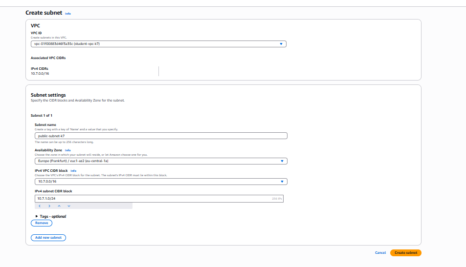

# Лабораторная работа №3. Облачные сети (AWS VPC)

## Описание лабораторной работы

Данная лабораторная работа посвящена изучению работы с виртуальными частными облачными сетями (Virtual Private Cloud - VPC) в Amazon Web Services. В ходе работы студенты получают практические навыки создания изолированной сетевой инфраструктуры в облаке, настройки маршрутизации трафика и обеспечения безопасности сетевых ресурсов.

### Основные понятия

**Amazon VPC** — это виртуальная сеть, полностью изолированАная от других пользователей AWS. VPC позволяет контролировать все аспекты сетевой конфигурации: адресное пространство, подсети, маршруты и политики безопасности.

**Основные компоненты архитектуры:**
- **Публичная подсеть** — для ресурсов с доступом из Интернета
- **Приватная подсеть** — для внутренних ресурсов без прямого доступа извне
- **Internet Gateway (IGW)** — обеспечивает доступ в Интернет для публичных ресурсов
- **NAT Gateway** — позволяет приватным ресурсам инициировать исходящие соединения в Интернет
- **Route Tables** — определяют правила маршрутизации трафика
- **Security Groups** — виртуальные брандмауэры на уровне инстансов

## Постановка задачи

Создать в AWS полнофункциональную сетевую инфраструктуру, состоящую из:
- VPC с CIDR блоком 10.(k%30).0.0/16
- Публичной подсети для веб-сервера (10.(k%30).1.0/24)
- Приватной подсети для сервера базы данных (10.(k%30).2.0/24)
- Internet Gateway для публичного доступа
- NAT Gateway для исходящего трафика из приватной подсети
- Трех EC2 инстансов: web-server, db-server, bastion-host
- Соответствующих Security Groups для контроля доступа

**Конечная цель:** веб-сервер в публичной подсети должен быть доступен из Интернета, база данных в приватной подсети — изолирована от прямого внешнего доступа, но доступна веб-серверу и через bastion host.

## Цель и основные этапы работы

### Цель работы

Получить практические навыки в:
- Ручном создании виртуальной сети (VPC) в AWS
- Настройке подсетей различного типа (публичные и приватные)
- Конфигурации таблиц маршрутов
- Работе с Internet Gateway и NAT Gateway
- Настройке Security Groups для контроля доступа
- Развертывании EC2 инстансов в различных подсетях
- Обеспечении безопасного доступа к приватным ресурсам через Bastion Host

### Основные этапы

1. Создание VPC
2. Настройка Internet Gateway
3. Создание публичной и приватной подсетей
4. Конфигурация таблиц маршрутов
5. Развертывание NAT Gateway
6. Создание Security Groups
7. Запуск EC2 инстансов
8. Проверка работоспособности сети
9. Настройка доступа через Bastion Host

## Практическая часть

### Шаг 1. Подготовка среды

**Действия:**
1. Вход в AWS Management Console
2. Установка региона **Frankfurt (eu-central-1)**
3. Переход в консоль VPC через поиск

**Пояснение:** Регион определяет физическое расположение датацентров AWS. Frankfurt выбран как ближайший регион с полным набором сервисов.

---

### Шаг 2. Создание VPC

**Действия:**
1. В левой панели: Your VPCs → Create VPC
2. Параметры:
   - **Name tag:** `student-vpc-k7` (где k=7 — порядковый номер)
   - **IPv4 CIDR block:** `10.7.0.0/16`
   - **Tenancy:** Default
3. Нажать Create VPC

**Расчет CIDR:** Для k=7: 10.(7%30).0.0/16 = 10.7.0.0/16


**Ответ на вопрос:**

> **Что обозначает маска /16? И почему нельзя использовать /8?**

Маска **/16** означает, что первые 16 бит IP-адреса зарезервированы под сетевой префикс, а оставшиеся 16 бит (65,536 адресов) доступны для хостов. Это диапазон от 10.12.0.0 до 10.12.255.255.

Маску **/8** (например, 10.0.0.0/8) нельзя использовать в VPC по следующим причинам:
- AWS ограничивает размер VPC диапазоном от /16 до /28
- Сеть /8 содержит более 16 миллионов адресов, что избыточно и создает проблемы управления
- AWS резервирует определенные диапазоны для внутреннего использования

---

### Шаг 3. Создание Internet Gateway (IGW)

**Действия:**
1. В левой панели: Internet Gateways → Create internet gateway
2. **Name:** `student-igw-k7`
3. Создать и прикрепить к VPC:
   - Выбрать созданный IGW
   - Actions → Attach to VPC
   - Выбрать `student-vpc-k7`


**Пояснение:** Internet Gateway — это горизонтально масштабируемый, избыточный и высокодоступный компонент VPC, который обеспечивает связь между VPC и Интернетом. Без IGW инстансы с публичными IP не смогут взаимодействовать с внешним миром.

---

### Шаг 4. Создание подсетей

#### Шаг 4.1. Создание публичной подсети

**Действия:**
1. Subnets → Create subnet
2. Параметры:
   - **VPC ID:** `student-vpc-k7`
   - **Subnet name:** `public-subnet-k7`
   - **Availability Zone:** `eu-central-1a`
   - **IPv4 CIDR block:** `10.7.1.0/24` (256 адресов)
3. Create subnet



**Ответ на вопрос:**

> **Является ли подсеть "публичной" на данный момент? Почему?**

**Нет**, подсеть пока не является публичной. Для того чтобы подсеть стала публичной, необходимо:
1. Создать таблицу маршрутов с маршрутом 0.0.0.0/0 → Internet Gateway
2. Ассоциировать эту таблицу маршрутов с подсетью
3. Включить автоматическое назначение публичных IP для инстансов в этой подсети

Сама по себе подсеть — это просто диапазон IP-адресов. Публичной или приватной её делают правила маршрутизации.

#### Шаг 4.2. Создание приватной подсети

**Действия:**
1. Create subnet (повторно)
2. Параметры:
   - **VPC ID:** `student-vpc-k7`
   - **Subnet name:** `private-subnet-k7`
   - **Availability Zone:** `eu-central-1b`
   - **IPv4 CIDR block:** `10.7.2.0/24`
3. Create subnet


**Ответ на вопрос:**

> **Является ли подсеть "приватной" на данный момент? Почему?**

**Технически нет**, она пока просто не имеет маршрута в Интернет. Подсеть станет приватной, когда:
1. Её таблица маршрутов не будет содержать маршрут в Интернет через IGW
2. Исходящий трафик (при необходимости) будет направляться через NAT Gateway

По умолчанию новые подсети используют основную таблицу маршрутов VPC, которая содержит только локальные маршруты. Это означает, что инстансы в этой подсети могут взаимодействовать только внутри VPC.

---

### Шаг 5. Создание таблиц маршрутов

#### Шаг 5.1. Публичная таблица маршрутов

**Действия:**
1. Route Tables → Create route table
2. Параметры:
   - **Name tag:** `public-rt-k7`
   - **VPC:** `student-vpc-k7`
3. Создать и настроить маршруты:
   - Routes → Edit routes → Add route
   - **Destination:** `0.0.0.0/0`
   - **Target:** Internet Gateway (`student-igw-k7`)
   - Save changes
4. Ассоциировать с подсетью:
   - Subnet associations → Edit subnet associations
   - Выбрать `public-subnet-k7`
   - Save associations


**Ответ на вопрос:**

> **Зачем необходимо привязать таблицу маршрутов к подсети?**

Привязка (ассоциация) таблицы маршрутов к подсети необходима, потому что:
1. **Каждая подсеть должна быть связана ровно с одной таблицей маршрутов** — это определяет, как трафик из этой подсети будет маршрутизироваться
2. Таблица маршрутов содержит правила, которые определяют, куда направлять сетевые пакеты на основе IP-адреса назначения
3. Без привязки подсеть использует основную таблицу маршрутов VPC по умолчанию
4. Разные подсети могут иметь разные таблицы маршрутов, что позволяет создавать публичные и приватные подсети в одной VPC

**Пояснение:** Маршрут `0.0.0.0/0 → IGW` означает "весь трафик, не предназначенный для локальной сети VPC, отправлять через Internet Gateway". Именно этот маршрут делает подсеть публичной.

#### Шаг 5.2. Приватная таблица маршрутов

**Действия:**
1. Route Tables → Create route table
2. Параметры:
   - **Name tag:** `private-rt-k7`
   - **VPC:** `student-vpc-k7`
3. Ассоциировать с приватной подсетью:
   - Subnet associations → Edit subnet associations
   - Выбрать `private-subnet-k7`
   - Save associations


**Пояснение:** На данном этапе в приватной таблице маршрутов есть только локальный маршрут для взаимодействия внутри VPC. Маршрут через NAT Gateway будет добавлен позже.

---

### Шаг 6. Создание NAT Gateway

**Пояснение работы NAT Gateway:**

NAT Gateway (Network Address Translation Gateway) работает как посредник между приватными инстансами и Интернетом:
- Инстансы в приватной подсети инициируют исходящие соединения (например, для обновлений)
- NAT Gateway заменяет приватный IP инстанса на свой публичный Elastic IP
- Ответы из Интернета приходят на NAT Gateway, который перенаправляет их обратно инстансу
- Входящие соединения из Интернета блокируются — NAT Gateway работает только в одну сторону

#### Шаг 6.1. Создание Elastic IP

**Действия:**
1. Elastic IPs → Allocate Elastic IP address
2. Allocate


**Пояснение:** Elastic IP — это статический публичный IPv4-адрес. В отличие от динамических публичных IP, которые меняются при перезапуске инстанса, Elastic IP остается постоянным и закрепляется за аккаунтом AWS.

#### Шаг 6.2. Создание NAT Gateway

**Действия:**
1. NAT Gateways → Create NAT gateway
2. Параметры:
   - **Name tag:** `nat-gateway-k7`
   - **Subnet:** `public-subnet-k7`
   - **Connectivity type:** Public
   - **Elastic IP allocation ID:** выбрать созданный EIP
3. Create NAT gateway
4. Дождаться статуса Available (2-3 минуты)


**Важно:** NAT Gateway создается в публичной подсети, так как ему нужен прямой доступ к Интернету через IGW.

#### Шаг 6.3. Обновление приватной таблицы маршрутов

**Действия:**
1. Route Tables → `private-rt-k7`
2. Routes → Edit routes → Add route
3. Параметры:
   - **Destination:** `0.0.0.0/0`
   - **Target:** NAT Gateway (`nat-gateway-k7`)
4. Save changes


**Пояснение:** Теперь инстансы в приватной подсети могут инициировать исходящие соединения в Интернет через NAT Gateway, при этом оставаясь недоступными для входящих соединений извне.

---

### Шаг 7. Создание Security Groups

Security Groups — это stateful брандмауэры на уровне инстансов. "Stateful" означает, что если разрешен входящий трафик, ответный исходящий трафик разрешается автоматически.

#### 7.1. Security Group для веб-сервера (web-sg)

**Действия:**
1. Security Groups → Create security group
2. Параметры:
   - **Security group name:** `web-sg-k7`
   - **Description:** Security group for web server
   - **VPC:** `student-vpc-k7`
3. Inbound rules:
   - **HTTP:** Type=HTTP, Protocol=TCP, Port=80, Source=0.0.0.0/0
   - **HTTPS:** Type=HTTPS, Protocol=TCP, Port=443, Source=0.0.0.0/0
4. Create security group


#### 7.2. Security Group для Bastion Host (bastion-sg)

**Действия:**
1. Create security group
2. Параметры:
   - **Security group name:** `bastion-sg-k7`
   - **Description:** Security group for bastion host
   - **VPC:** `student-vpc-k7`
3. Inbound rules:
   - **SSH:** Type=SSH, Protocol=TCP, Port=22, Source=My IP (автоматически определяется ваш IP)
4. Create security group


**Ответ на вопрос:**

> **Что такое Bastion Host и зачем он нужен в архитектуре с приватными подсетями?**

**Bastion Host** (или Jump Server) — это специальный инстанс в публичной подсети, который служит единственной точкой входа для администраторов в приватную сеть.

**Назначение и преимущества:**
1. **Безопасность:** вместо открытия SSH доступа к каждому приватному серверу, открывается доступ только к Bastion Host
2. **Аудит:** весь административный доступ проходит через одну точку, что упрощает мониторинг и логирование
3. **Контроль:** можно централизованно управлять, кто имеет доступ к приватным ресурсам
4. **Минимизация атаки:** уменьшается площадь атаки, так как только один сервер доступен из Интернета

**Принцип работы:**
- Администратор подключается по SSH к Bastion Host из Интернета
- С Bastion Host администратор может подключиться к любому инстансу в приватной подсети
- Приватные инстансы не имеют публичных IP и недоступны напрямую извне

#### 7.3. Security Group для базы данных (db-sg)

**Действия:**
1. Create security group
2. Параметры:
   - **Security group name:** `db-sg-k7`
   - **Description:** Security group for database server
   - **VPC:** `student-vpc-k7`
3. Inbound rules:
   - **MySQL:** Type=MySQL/Aurora, Protocol=TCP, Port=3306, Source=web-sg-k7
   - **SSH:** Type=SSH, Protocol=TCP, Port=22, Source=bastion-sg-k7
4. Create security group


**Пояснение:** 
- Порт 3306 открыт только для веб-сервера (через Security Group ID)
- SSH доступ разрешен только с Bastion Host
- Это обеспечивает принцип наименьших привилегий (Principle of Least Privilege)

---

### Шаг 8. Создание EC2 инстансов

#### 8.1. Веб-сервер (web-server)

**Действия:**
1. EC2 → Launch Instance
2. Параметры:
   - **Name:** `web-server-k7`
   - **AMI:** Amazon Linux 2 AMI (HVM), SSD Volume Type
   - **Instance type:** t3.micro
   - **Key pair:** создать новый `student-key-k7` и скачать
   - **Network settings:**
     - VPC: `student-vpc-k7`
     - Subnet: `public-subnet-k7`
     - Auto-assign Public IP: **Enable**
     - Security group: `web-sg-k7`
   - **Storage:** 8 GB (по умолчанию)
3. Advanced Details → User data:

```bash
#!/bin/bash
dnf install -y httpd php
echo "<?php phpinfo(); ?>" > /var/www/html/index.php
systemctl enable httpd
systemctl start httpd
```

4. Launch instance


**Пояснение User Data:**
- Скрипт выполняется автоматически при первом запуске инстанса
- Устанавливает Apache (httpd) и PHP
- Создает тестовую страницу с информацией о PHP
- Включает автозапуск и запускает веб-сервер

#### 8.2. Сервер базы данных (db-server)

**Действия:**
1. Launch Instance
2. Параметры:
   - **Name:** `db-server-k7`
   - **AMI:** Amazon Linux 2 AMI
   - **Instance type:** t3.micro
   - **Key pair:** `student-key-k7`
   - **Network settings:**
     - VPC: `student-vpc-k7`
     - Subnet: `private-subnet-k7`
     - Auto-assign Public IP: **Disable**
     - Security group: `db-sg-k7`
3. User data:

```bash
#!/bin/bash
dnf install -y mariadb105-server
systemctl enable mariadb
systemctl start mariadb
mysql -e "ALTER USER 'root'@'localhost' IDENTIFIED BY 'StrongPassword123!'; FLUSH PRIVILEGES;"
```

4. Launch instance


**Пояснение:** 
- Инстанс создается в приватной подсети без публичного IP
- Устанавливается MariaDB (MySQL-совместимая СУБД)
- Устанавливается пароль root для базы данных

#### 8.3. Bastion Host

**Действия:**
1. Launch Instance
2. Параметры:
   - **Name:** `bastion-host-k7`
   - **AMI:** Amazon Linux 2 AMI
   - **Instance type:** t3.micro
   - **Key pair:** `student-key-k7`
   - **Network settings:**
     - VPC: `student-vpc-k7`
     - Subnet: `public-subnet-k7`
     - Auto-assign Public IP: **Enable**
     - Security group: `bastion-sg-k7`
3. User data:

```bash
#!/bin/bash
dnf install -y mariadb105
```

4. Launch instance


**Пояснение:** Устанавливается только клиент MySQL для подключения к базе данных из приватной подсети.

---

### Шаг 9. Проверка работы

#### 9.1. Проверка веб-сервера

**Действия:**
1. Дождаться статуса `running` для всех инстансов
2. Скопировать публичный IP веб-сервера
3. Открыть в браузере: `http://54.93.216.231/`

**Ожидаемый результат:** Страница с информацией о PHP (phpinfo).


#### 9.2. Проверка Bastion Host

**Действия:**
1. Подключиться к Bastion Host:

```bash
ssh -i student-key-k7.pem ec2-user@<Bastion-Host-Public-IP>
```

2. Проверить доступ в Интернет:

```bash
ping -c 4 google.com
```

**Ожидаемый результат:** Успешные ping-ответы (4 пакета отправлено и получено).


**Вывод:** Публичная подсеть и Internet Gateway настроены правильно.

#### 9.3. Проверка подключения к базе данных

**Действия:**
1. С Bastion Host подключиться к DB серверу:

```bash
mysql -h 10.7.1.204 -u root -p
```

2. Ввести пароль: `StrongPassword123!`

**Ожидаемый результат:** Успешное подключение к MySQL.Но ответа нет

**Вывод:**  для полноценной работы с базой данных через Bastion Host необходимо добавить дополнительное правило в db-sg-k7, разрешающее MySQL трафик с bastion-sg-k7.


