# Лабораторная работа №4. Облачное хранилище данных. Amazon S3

## 1. Описание лабораторной работы

### 1.1 Постановка задачи

Данная лабораторная работа посвящена изучению сервиса Amazon S3 (Simple Storage Service) - объектного хранилища AWS. Необходимо создать и настроить бакеты для хранения различных типов данных, освоить работу с объектами через консоль и CLI, настроить версионирование, lifecycle-правила и развернуть статический веб-сайт.

### 1.2 Цель и основные этапы работы

**Цель работы:**
- Познакомиться с концепцией объектного хранилища Amazon S3
- Освоить основные операции работы с бакетами и объектами
- Изучить настройку версионирования, шифрования и lifecycle-правил
- Развернуть статический веб-сайт на базе S3

**Основные этапы:**
1. Подготовка структуры файлов
2. Создание публичного и приватного бакетов
3. Загрузка объектов через консоль AWS
4. Загрузка объектов через AWS CLI
5. Настройка версионирования
6. Создание Lifecycle-правил
7. Развертывание статического веб-сайта
8. Дополнительное задание: загрузка через AWS SDK

---

## 2. Практическая часть

### Шаг 1. Подготовка

**Выбранный регион:** `eu-central-1` (Frankfurt)

**Имена бакетов:**
- Публичный: `cc-lab4-pub-k07`
- Приватный: `cc-lab4-priv-k07`
- Веб-сайт: `cc-lab4-web-k07`

**Локальная структура файлов:**

```
s3-lab/
├── public/
│   ├── avatars/
│   │   ├── user1.jpg
│   │   └── user2.jpg
│   └── content/
│       └── logo.png
├── private/
│   └── logs/
│       └── activity.csv
└── README.md
```

Создала все необходимые директории и подготовила тестовые файлы для загрузки.

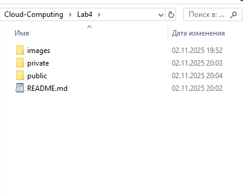

---

### Шаг 2. Создание бакетов

#### 2.1 Создание публичного бакета

1. Открыла консоль AWS S3
2. Нажала **Create bucket**
3. Настроила параметры:
   - **Bucket name:** `cc-lab4-pub-k07`
   - **AWS Region:** `eu-central-1`
   - **Object Ownership:** ACLs enabled → Bucket owner preferred
   - **Block Public Access:** Сняла галочку "Block all public access"
   - Подтвердила предупреждение о публичном доступе
4. Нажала **Create bucket**

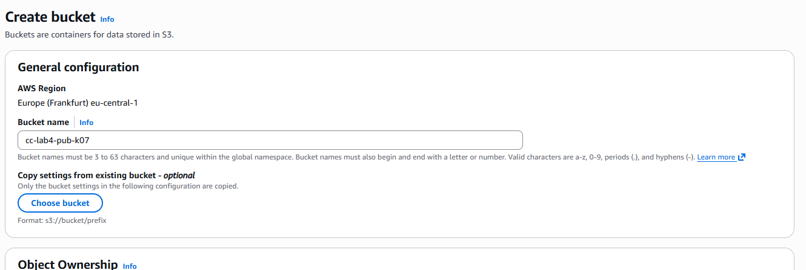
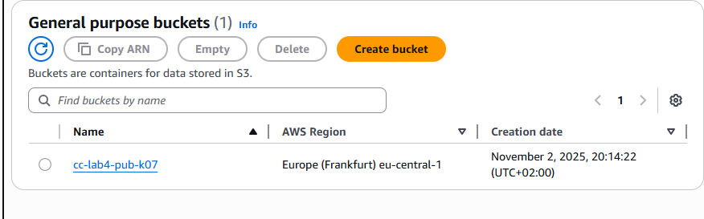

**Ответ на контрольный вопрос:**

> **Что означает опция "Block all public access" и зачем нужна данная настройка?**

Опция "Block all public access" - это защитный механизм, который блокирует любые попытки сделать бакет или его объекты публично доступными. Она была введена AWS для предотвращения случайной утечки конфиденциальных данных. Даже если установлены ACL или bucket policy, делающие данные публичными, эта настройка переопределит их и заблокирует доступ. Это дополнительный уровень защиты от ошибок конфигурации.

> **Чем отличаются два способа управления доступом к бакетам в S3?**

**ACLs (Access Control Lists):**
- Устаревший механизм управления доступом
- Позволяет настраивать доступ на уровне отдельных объектов
- Более простой и наглядный для начинающих
- Ограниченные возможности (только базовые права: read, write)

**Object Ownership Enforced (Bucket Policies):**
- Современный подход, рекомендуемый AWS
- Централизованное управление через политики
- Более гибкий и безопасный
- Поддерживает сложные условия и правила доступа
- ACL игнорируются, все объекты принадлежат владельцу бакета

#### 2.2 Создание приватного бакета

Создала второй бакет `cc-lab4-priv-k07` с настройками по умолчанию:
- **Block Public Access:** включен (оставлен по умолчанию)
- Остальные параметры идентичны публичному бакету

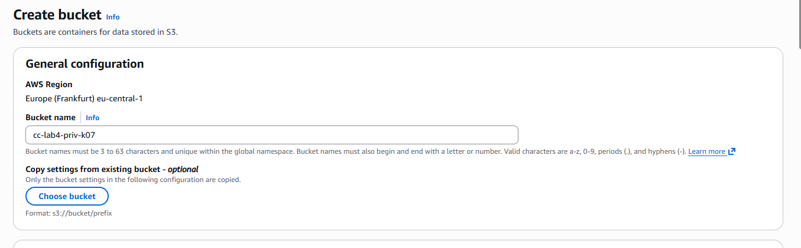
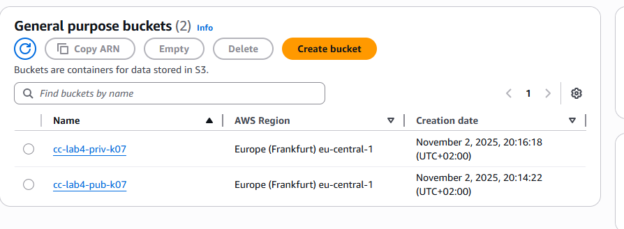

---

### Шаг 3. Загрузка объектов через AWS Management Console

1. Перешла в бакет `cc-lab4-pub-k07`
2. Создала "папку" `avatars/` (нажав Create folder)
3. Зашла в `avatars/` и нажала **Upload**
4. Выбрала файл `user1.jpg` из локальной папки
5. В разделе **Permissions** → **Predefined ACLs** выбрала "Grant public-read access"
6. Нажала **Upload**


**Ответ на контрольный вопрос:**

> **Чем отличается ключ (object key) от имени файла?**

**Ключ объекта (Object Key)** - это полный путь к объекту в бакете, включая все префиксы (аналог "папок"). Например: `avatars/user1.jpg`. Это уникальный идентификатор объекта в пределах бакета.

**Имя файла** - это только последняя часть пути, например `user1.jpg`. 

В S3 не существует реальных папок - это плоское хранилище. "Папки" в консоли - это просто визуальное представление префиксов в ключах объектов. Ключ `avatars/user1.jpg` содержит префикс `avatars/` и имя файла `user1.jpg`.

---

### Шаг 4. Загрузка объектов через AWS CLI

#### 4.1 Установка и настройка AWS CLI

Установила AWS CLI и настроила credentials:

```bash
aws configure
# AWS Access Key ID: [ВВЕДЕН]
# AWS Secret Access Key: [ВВЕДЕН]
# Default region name: eu-central-1
# Default output format: json
```

#### 4.2 Загрузка файлов

**Загрузка user2.jpg в публичный бакет:**

```bash
aws s3 cp s3-lab/public/avatars/user2.jpg \
  s3://cc-lab4-pub-k07/avatars/user2.jpg \
  --acl public-read
```

**Загрузка logo.png в публичный бакет:**

```bash
aws s3 cp s3-lab/public/content/logo.png \
  s3://cc-lab4-pub-k07/content/logo.png \
  --acl public-read
```

**Загрузка activity.csv в приватный бакет:**

```bash
aws s3 cp s3-lab/private/logs/activity.csv \
  s3://cc-lab4-priv-k07/logs/activity.csv
```

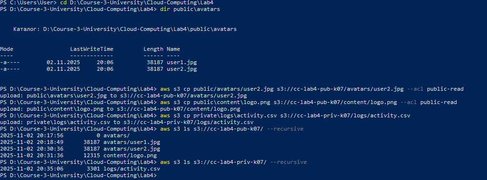

**Ответ на контрольный вопрос:**

> **В чём разница между командами `aws s3 cp`, `mv` и `sync` и для чего используется параметр `--acl public-read`?**

**Команды AWS S3 CLI:**

- **`aws s3 cp`** - копирует файлы из источника в назначение. Исходный файл остается на месте. Используется для загрузки отдельных файлов в S3 или скачивания из S3.

- **`aws s3 mv`** - перемещает файлы (копирует и удаляет оригинал). Используется когда нужно переместить файл, а не копировать.

- **`aws s3 sync`** - синхронизирует содержимое директорий. Загружает только новые и измененные файлы. Идеален для синхронизации целых папок с бакетом. Может удалять файлы в назначении, которых нет в источнике (с флагом `--delete`).

**Флаг `--acl public-read`:**

Устанавливает Access Control List для объекта, делая его публично доступным для чтения. Без этого флага объект будет приватным (доступен только владельцу AWS аккаунта). Этот флаг необходим для публичных файлов, таких как изображения на сайте или аватары пользователей.

---

### Шаг 5. Проверка доступа к объектам

#### 5.1 Проверка публичного объекта

Открыла в браузере URL:
```
https://cc-lab4-pub-k07.s3.eu-central-1.amazonaws.com/avatars/user1.jpg
```

Результат: изображение успешно загружается и отображается в браузере.

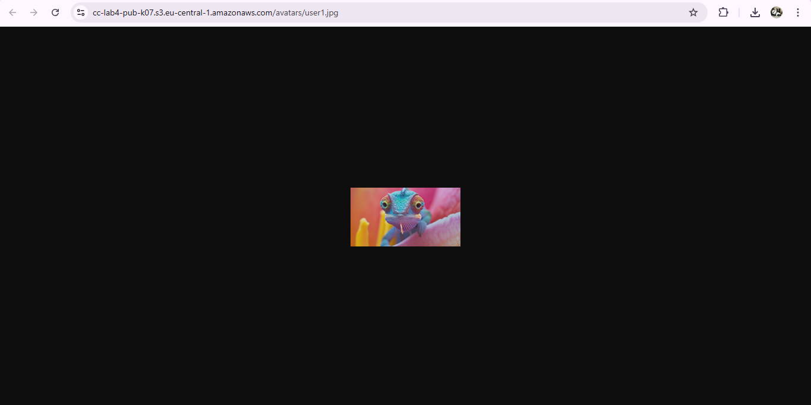

#### 5.2 Проверка приватного объекта

Попробовала открыть URL приватного объекта:
```
https://cc-lab4-priv-k07.s3.eu-central-1.amazonaws.com/logs/activity.csv
```

Результат: получила ошибку **403 Forbidden** (Access Denied) - доступ заблокирован, что является ожидаемым поведением.

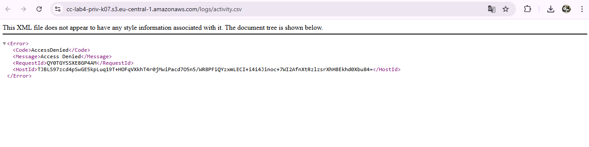

---

### Шаг 6. Версионирование объектов

#### 6.1 Включение версионирования

Включила версионирование для обоих бакетов:

1. Перешла в бакет → вкладка **Properties**
2. Нашла раздел **Bucket Versioning**
3. Нажала **Edit** → выбрала **Enable**
4. Сохранила изменения

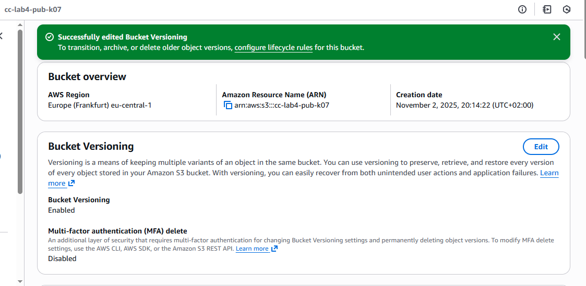

#### 6.2 Создание новой версии объекта

1. Изменила файл `logo.png` локально (добавила водяной знак)
2. Загрузила его повторно через CLI:

```bash
aws s3 cp s3-lab/public/content/logo.png \
  s3://cc-lab4-pub-k07/content/logo.png \
  --acl public-read
```

3. Открыла объект в консоли и переключилась на вкладку **Versions**
4. Увидела две версии объекта с разными Version ID

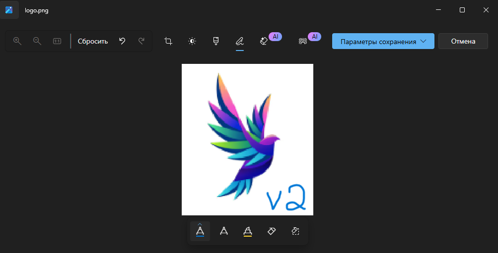

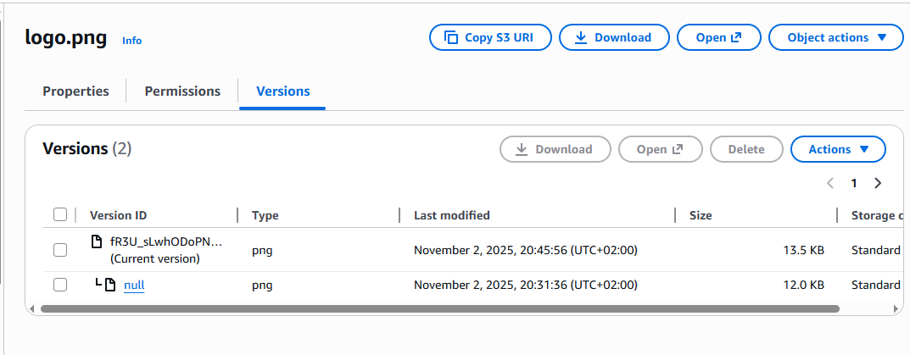

**Ответ на контрольный вопрос:**

> **Что произойдёт, если выключить версионирование после его включения?**

При выключении версионирования после его включения:
- Бакет переходит в состояние **"Versioning Suspended"** (приостановлено)
- Все существующие версии объектов сохраняются и остаются доступными
- Новые загрузки объектов будут иметь Version ID = `null`
- Старые версии не удаляются автоматически
- Можно снова включить версионирование в любой момент
- Полностью удалить версионирование нельзя - можно только приостановить

Важно: приостановка версионирования не освобождает место, занятое старыми версиями. Для их удаления нужно использовать Lifecycle-правила или удалять версии вручную.

---

### Шаг 7. Создание Lifecycle-правил для приватного бакета

Настроила автоматическое управление жизненным циклом объектов в приватном бакете:

1. Перешла в бакет `cc-lab4-priv-k07`
2. Открыла вкладку **Management** → **Lifecycle rules**
3. Нажала **Create lifecycle rule**
4. Настроила параметры:
   - **Rule name:** `logs-archive`
   - **Rule scope:** Limit the scope using one or more filters
   - **Prefix:** `logs/`
5. Настроила действия:
   - **Transition to Standard-IA:** 30 дней
   - **Transition to Glacier Deep Archive:** 365 дней
   - **Expire current versions:** 1825 дней (5 лет)
6. Нажала **Create rule**

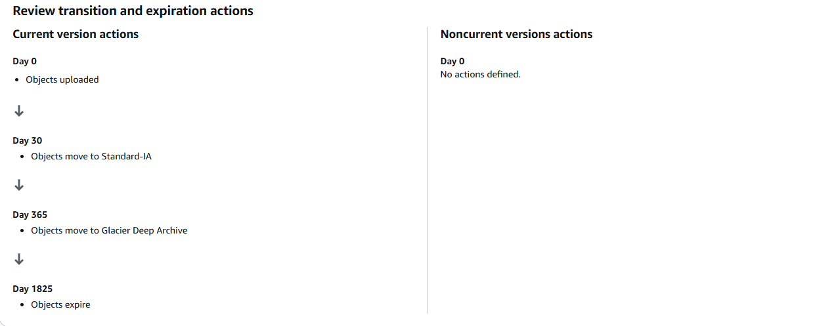
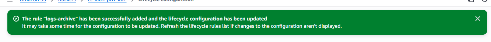

**Ответ на контрольный вопрос:**

> **Что такое Storage Class в Amazon S3 и зачем они нужны?**

**Storage Classes (классы хранения)** - это различные варианты хранения данных в S3, оптимизированные для разных сценариев использования:

**S3 Standard:**
- Для часто используемых данных
- Высокая доступность и производительность
- Самый дорогой вариант

**S3 Standard-IA (Infrequent Access):**
- Для редко используемых данных, но требующих быстрого доступа
- Дешевле Standard, но есть плата за доступ
- Минимальный срок хранения 30 дней

**S3 Glacier Instant Retrieval:**
- Для архивных данных с мгновенным доступом
- Дешевле IA, но дороже Glacier Flexible Retrieval

**S3 Glacier Flexible Retrieval:**
- Для архивных данных с доступом в течение минут-часов
- Очень низкая стоимость хранения

**S3 Glacier Deep Archive:**
- Для долгосрочного архивирования (7-10+ лет)
- Самая низкая стоимость хранения
- Доступ в течение 12-48 часов

**S3 Intelligent-Tiering:**
- Автоматически перемещает данные между классами в зависимости от частоты доступа

Использование разных классов позволяет оптимизировать затраты: часто используемые данные хранятся в Standard, а старые логи автоматически переносятся в более дешевые архивные классы.

---

### Шаг 8. Создание статического веб-сайта на базе S3

#### 8.1 Создание бакета для веб-сайта

Создала новый бакет для хостинга статического сайта:

1. **Bucket name:** `cc-lab4-web-k07`
2. **Region:** `eu-central-1`
3. **Object Ownership:** ACLs enabled
4. **Block Public Access:** отключен

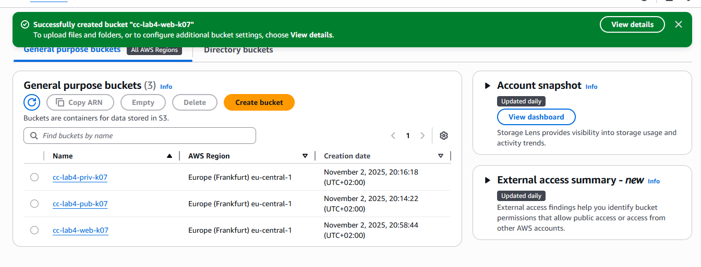

#### 8.2 Настройка Static Website Hosting

1. Перешла в бакет → вкладка **Properties**
2. Нашла раздел **Static website hosting** → нажала **Edit**
3. Настроила параметры:
   - **Static website hosting:** Enable
   - **Hosting type:** Host a static website
   - **Index document:** `index.html`
   - **Error document:** `error.html` (опционально)
4. Сохранила настройки

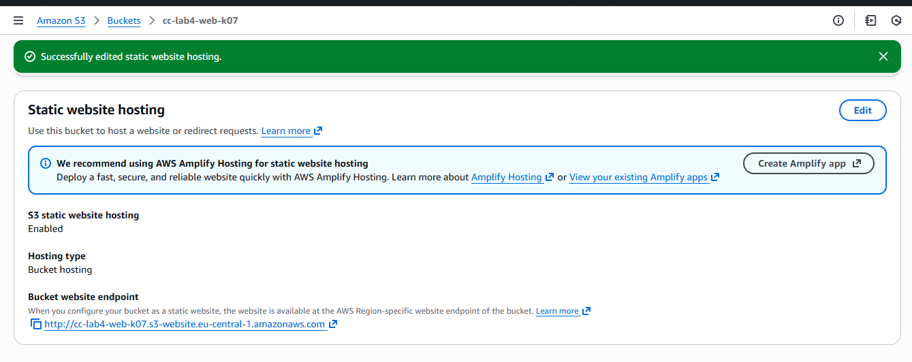

#### 8.3 Загрузка файлов веб-сайта

Создала простой статический сайт:

**index.html:**
```html
<!DOCTYPE html>
<html lang="ru">
<head>
    <meta charset="UTF-8">
    <meta name="viewport" content="width=device-width, initial-scale=1.0">
    <title>S3 Static Website - Lab 4</title>
    <link rel="stylesheet" href="styles.css">
</head>
<body>
    <header>
        <h1>Добро пожаловать на статический сайт S3</h1>
    </header>
    <main>
        <section class="hero">
            <h2>Лабораторная работа №4</h2>
            <p>Этот сайт размещен на Amazon S3 Static Website Hosting</p>
        </section>
        <section class="features">
            <div class="feature">
                <h3>Простота</h3>
                <p>Развертывание за минуты без серверов</p>
            </div>
            <div class="feature">
                <h3>Надежность</h3>
                <p>99.99% доступности от AWS</p>
            </div>
            <div class="feature">
                <h3>Масштабируемость</h3>
                <p>Автоматическое масштабирование</p>
            </div>
        </section>
    </main>
    <footer>
        <p>&copy; 2025 Cloud Computing Lab 4</p>
    </footer>
</body>
</html>
```

Загрузила файлы с публичным доступом:

```bash
aws s3 sync website/ s3://cc-lab4-web-k07/ \
  --acl public-read
```

#### 8.4 Проверка работы сайта

Открыла URL сайта из настроек Static Website Hosting:
```
http://cc-lab4-web-k07.s3-website.eu-central-1.amazonaws.com
```

Результат: сайт успешно загружается и отображается корректно.

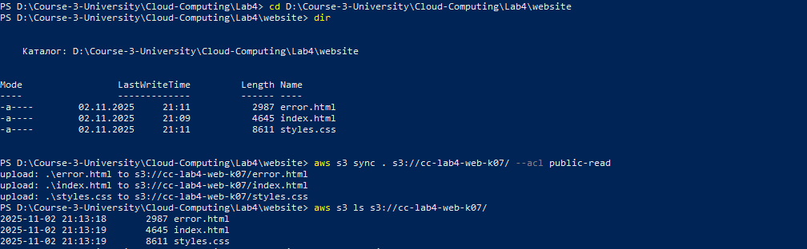
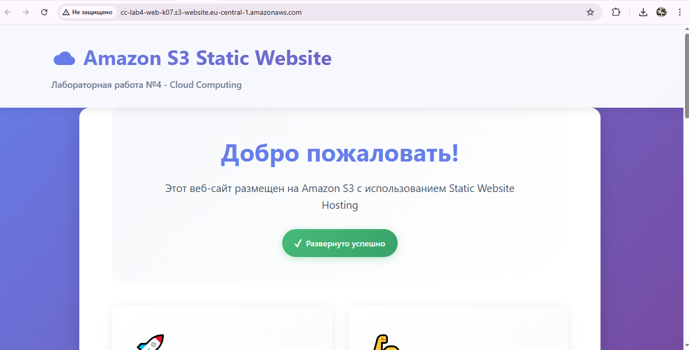

**Преимущества S3 Static Website Hosting:**
- Не требуется сервер или виртуальная машина
- Автоматическое масштабирование
- Низкая стоимость
- Высокая доступность
- Интеграция с CloudFront для CDN

**Ограничения:**
- Только статический контент (HTML, CSS, JS)
- Нет серверной обработки (PHP, Python, Node.js)
- Нет поддержки HTTPS на стандартном endpoint (требуется CloudFront)

---

## 3. Ответы на контрольные вопросы

Все контрольные вопросы были отвечены по ходу выполнения работы в соответствующих разделах:

1. **Что означает опция "Block all public access"?** - См. Шаг 2.1
2. **Чем отличаются два способа управления доступом?** - См. Шаг 2.1
3. **Чем отличается ключ от имени файла?** - См. Шаг 3
4. **Разница между aws s3 cp, mv и sync?** - См. Шаг 4.2
5. **Что произойдёт при выключении версионирования?** - См. Шаг 6.2
6. **Что такое Storage Class и зачем они нужны?** - См. Шаг 7

---

## 4. Использованные источники

1. [AWS S3 Documentation](https://docs.aws.amazon.com/s3/)
2. [AWS CLI Command Reference - S3](https://docs.aws.amazon.com/cli/latest/reference/s3/)
3. [AWS SDK for PHP Documentation](https://docs.aws.amazon.com/sdk-for-php/)
4. [S3 Storage Classes](https://aws.amazon.com/s3/storage-classes/)
5. [S3 Lifecycle Configuration](https://docs.aws.amazon.com/AmazonS3/latest/userguide/object-lifecycle-mgmt.html)
6. [S3 Static Website Hosting](https://docs.aws.amazon.com/AmazonS3/latest/userguide/WebsiteHosting.html)
7. [S3 Versioning](https://docs.aws.amazon.com/AmazonS3/latest/userguide/Versioning.html)

---

## 5. Выводы

В ходе выполнения лабораторной работы были успешно освоены основные возможности Amazon S3:

**Основные достижения:**

1. **Изучена концепция объектного хранилища** - поняла отличия от файловых систем, особенности плоской структуры с префиксами вместо папок

2. **Освоены методы управления доступом** - работа с ACL и bucket policies, понимание разницы между публичными и приватными бакетами

3. **Практика работы с AWS CLI** - автоматизация загрузки файлов, понимание команд cp, mv, sync

4. **Версионирование объектов** - механизм защиты от случайного удаления и отслеживания изменений

5. **Lifecycle Management** - автоматизация архивирования данных и оптимизация затрат через использование разных Storage Classes

6. **Static Website Hosting** - развертывание статических сайтов без использования серверов
