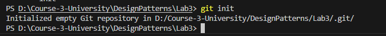
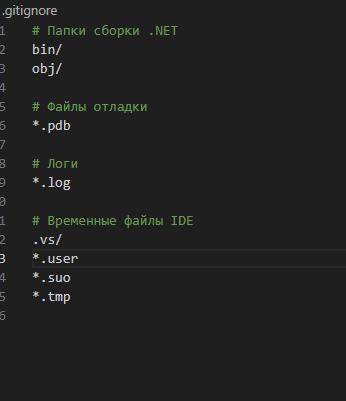
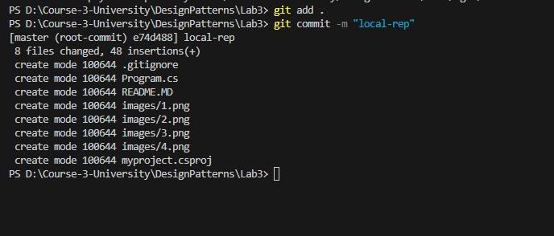
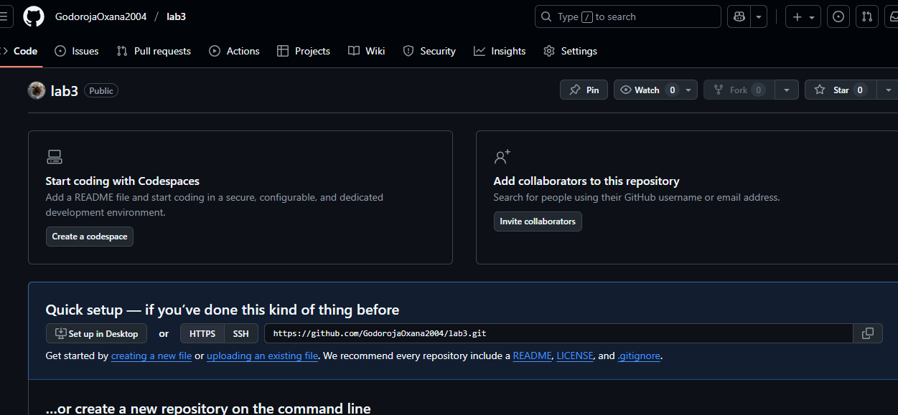
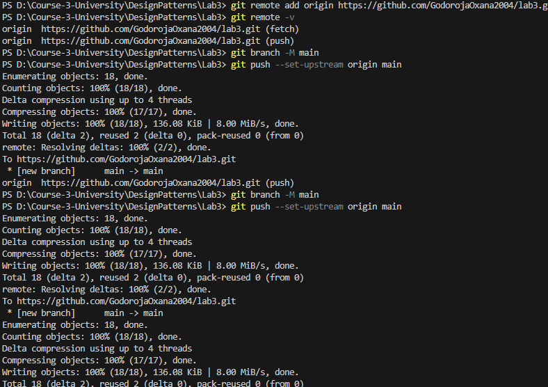

# Лабораторная работа 3

Тема: **Настройка git**.
Выполнила: **Godoroja Oxana I2302**

## Задания

1. Инициализируйте git репозиторию для вашего проекта (или для папки, содержащей проект) (команда `git init`).

2. Добавьте файл `.gitignore`, в котором игнорируйте временные или сгенерированные при компиляции файлы.

1. Сконфигурируйте ваши данные в git (команда `git config`).

1. Сделайте коммит со всеми файлами проекта (команды `git add`, `git commit`) и `.gitignore`.

2. Создайте репозиторию на GitHub для лабораторных работ.

3. Свяжите локальнную репозиторию git с GitHub-овской (команды `git remote add` и `git push --set-upstream`).

 
