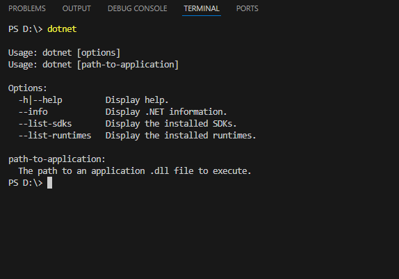
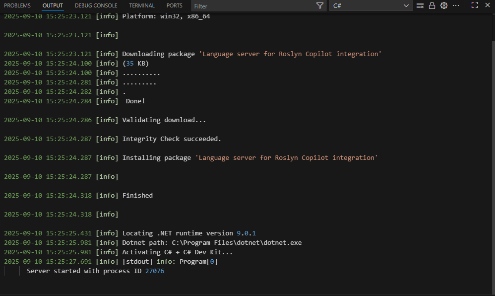

# Лабораторная работа 1
## Выполнила: Godoroja Oxana, Group I2302
Тема: **Установка .NET**.

## Задание

1. Установите .NET на ваш компьютер. 

   Если у вас есть администраторские права, установите .NET просто с официального сайта (поиск в Google),
   а если таковых не имеется руководствуйтесь инструкциями из видео.

2. Убедитесь, что `dotnet` доступен для выполнения в командной строке.

3. Создайте новый C# проект, создав файл конфигурации `.csproj` и файл с кодом `Program.cs`,
   согласно инструкциям из видео.

4. Попробуйте создать еще один новый проект, используя команду `dotnet new console`.

5. Скомпилируйте и выполните программу, используя команду `dotnet run`.
