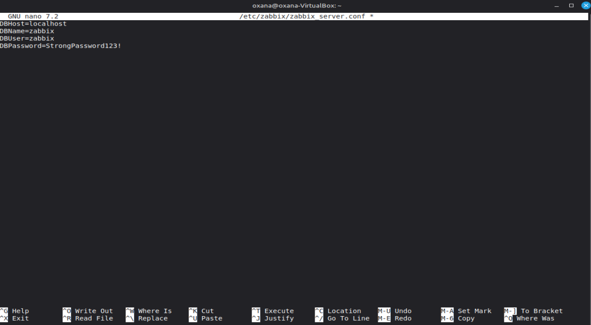

# Лабораторная работа №3
## Мониторинг ИТ-инфраструктуры с использованием Zabbix

**Выполнил:** Godoroja Oxana 
**Группа:** I2302  
**Дата:** 21 октября 2025 г.

---

## Цель работы

Ознакомление с системой Zabbix для мониторинга серверов, сервисов и сетевого оборудования.

## Задачи

- Установить и настроить сервер Zabbix
- Установить агент Zabbix на контролируемую машину
- Добавить и настроить хост в системе
- Просмотреть собираемые метрики и создать оповещения

## Используемое оборудование и ПО

- **ВМ 1 (Zabbix Server):** Ubuntu Server 22.04, IP: 192.168.1.100
- **ВМ 2 (Zabbix Agent):** Ubuntu Server 22.04, IP: 192.168.1.101
- **ПО:** Zabbix 6.4 LTS, MySQL 8.0, Nginx, Zabbix Agent

---

## Ход выполнения работы

### 1. Установка и настройка сервера Zabbix

#### 1.1. Подготовка системы

Обновляем список пакетов и систему:

```bash
sudo apt update && sudo apt upgrade -y
```


#### 1.2. Установка MySQL сервера

Устанавливаем MySQL:

```bash
sudo apt install mysql-server -y
```


Запускаем настройку безопасности MySQL:

```bash
sudo mysql_secure_installation
```


Параметры настройки:
- Validate Password Component: No
- Remove anonymous users: Yes
- Disallow root login remotely: Yes
- Remove test database: Yes
- Reload privilege tables: Yes

#### 1.3. Создание базы данных для Zabbix

Входим в MySQL:

```bash
sudo mysql -u root -p
```

Создаем базу данных и пользователя:

```sql
CREATE DATABASE zabbix CHARACTER SET utf8mb4 COLLATE utf8mb4_bin;
CREATE USER 'zabbix'@'localhost' IDENTIFIED BY 'StrongPassword123!';
GRANT ALL PRIVILEGES ON zabbix.* TO 'zabbix'@'localhost';
SET GLOBAL log_bin_trust_function_creators = 1;
FLUSH PRIVILEGES;
EXIT;
```


#### 1.4. Установка репозитория Zabbix

Скачиваем и устанавливаем репозиторий Zabbix:

```bash
wget https://repo.zabbix.com/zabbix/6.4/ubuntu/pool/main/z/zabbix-release/zabbix-release_6.4-1+ubuntu22.04_all.deb
sudo dpkg -i zabbix-release_6.4-1+ubuntu22.04_all.deb
sudo apt update
```


#### 1.5. Установка Zabbix сервера, фронтенда и агента

```bash
sudo apt install zabbix-server-mysql zabbix-frontend-php zabbix-nginx-conf zabbix-sql-scripts zabbix-agent -y
```

#### 1.6. Импорт начальной схемы данных

```bash
sudo zcat /usr/share/zabbix-sql-scripts/mysql/server.sql.gz | mysql --default-character-set=utf8mb4 -uzabbix -p zabbix
```

Вводим пароль: `StrongPassword123!`


Отключаем параметр в MySQL:

```bash
sudo mysql -u root -p
```

```sql
SET GLOBAL log_bin_trust_function_creators = 0;
EXIT;
```

#### 1.7. Настройка Zabbix сервера

Редактируем конфигурационный файл:

```bash
sudo nano /etc/zabbix/zabbix_server.conf
```

Находим и изменяем следующие строки:

```conf
DBHost=localhost
DBName=zabbix
DBUser=zabbix
DBPassword=StrongPassword123!
```

Сохраняем: `Ctrl+O`, `Enter`, `Ctrl+X`

#### 1.8. Настройка Nginx для Zabbix

Редактируем конфигурацию Nginx:

```bash
sudo nano /etc/zabbix/nginx.conf
```

Раскомментируем и изменяем строки:

```nginx
listen 8080;
server_name 192.168.1.100;
```

Сохраняем файл.

#### 1.9. Настройка PHP

Редактируем конфигурацию PHP:

```bash
sudo nano /etc/zabbix/php-fpm.conf
```

Проверяем параметры:

```conf
php_value[date.timezone] = Europe/Chisinau
```


#### 1.10. Запуск служб Zabbix

```bash
sudo systemctl restart zabbix-server zabbix-agent nginx php8.1-fpm
sudo systemctl enable zabbix-server zabbix-agent nginx php8.1-fpm
```

Проверяем статус служб:

```bash
sudo systemctl status zabbix-server
sudo systemctl status zabbix-agent
sudo systemctl status nginx
```

---

### 2. Настройка веб-интерфейса Zabbix

#### 2.1. Доступ к веб-интерфейсу

Открываем браузер и переходим по адресу:


#### 2.2. Мастер установки

**Шаг 1: Welcome**
- Нажимаем "Next step"

**Шаг 2: Check of pre-requisites**
- Проверяем, что все требования выполнены (все OK)
- Нажимаем "Next step"
- 


**Шаг 3: Configure DB connection**
- Database type: MySQL
- Database host: localhost
- Database port: 0 (по умолчанию)
- Database name: zabbix
- User: zabbix
- Password: StrongPassword123!
- Нажимаем "Next step"


**Шаг 4: Zabbix server details**
- Host: localhost
- Port: 10051
- Name: Zabbix Server (можно указать свое название)
- Нажимаем "Next step"

**Шаг 5: Pre-installation summary**
- Проверяем настройки
- Нажимаем "Next step"

**Шаг 6: Install**
- Установка завершена
- Нажимаем "Finish"

#### 2.3. Авторизация в системе

Данные для входа по умолчанию:
- **Username:** Admin
- **Password:** zabbix

После входа рекомендуется сменить пароль:
1. Нажимаем на иконку профиля в правом верхнем углу
2. Выбираем "User settings"
3. Переходим на вкладку "Password"
4. Меняем пароль на более надежный

---

### 3. Установка Zabbix Agent на контролируемой машине

Переходим на вторую виртуальную машину (192.168.1.101).

#### 3.1. Установка репозитория Zabbix

```bash
wget https://repo.zabbix.com/zabbix/6.4/ubuntu/pool/main/z/zabbix-release/zabbix-release_6.4-1+ubuntu22.04_all.deb
sudo dpkg -i zabbix-release_6.4-1+ubuntu22.04_all.deb
sudo apt update
```


#### 3.2. Установка Zabbix Agent

```bash
sudo apt install zabbix-agent -y
```

#### 3.3. Настройка Zabbix Agent

Редактируем конфигурационный файл:

```bash
sudo nano /etc/zabbix/zabbix_agentd.conf
```

Находим и изменяем следующие параметры:

```conf
Server=192.168.1.100
ServerActive=192.168.1.100
Hostname=Ubuntu-Agent-01
```

Где:
- **Server** — IP адрес Zabbix Server (пассивные проверки)
- **ServerActive** — IP адрес Zabbix Server (активные проверки)
- **Hostname** — имя хоста (должно совпадать с именем в веб-интерфейсе)

Сохраняем: `Ctrl+O`, `Enter`, `Ctrl+X`

#### 3.4. Запуск Zabbix Agent

```bash
sudo systemctl restart zabbix-agent
sudo systemctl enable zabbix-agent
```

Проверяем статус:

```bash
sudo systemctl status zabbix-agent
```

Проверяем, что агент слушает порт 10050:

```bash
sudo ss -tulpn | grep 10050
```

#### 3.5. Настройка файрвола (если включен)

```bash
sudo ufw allow 10050/tcp
```

---

### 4. Добавление хоста в веб-интерфейсе Zabbix

#### 4.1. Создание нового хоста

1. В веб-интерфейсе переходим: **Configuration → Hosts**
2. Нажимаем кнопку **"Create host"** в правом верхнем углу
3. Заполняем параметры:

**Вкладка "Host":**
- **Host name:** Ubuntu-Agent-01 (должно совпадать с Hostname в конфиге агента)
- **Visible name:** Ubuntu Agent 01 (отображаемое имя)
- **Groups:** Нажимаем "Select" → выбираем "Linux servers" → Add
- **Interfaces:** 
  - Type: Agent
  - IP address: 192.168.1.101
  - DNS name: (оставляем пустым)
  - Connect to: IP
  - Port: 10050

**Вкладка "Templates":**
- Нажимаем "Select"
- Ищем "Linux by Zabbix agent"
- Выбираем шаблон
- Нажимаем "Add"

**Вкладка "Macros":** (оставляем по умолчанию)

4. Нажимаем кнопку **"Add"**

#### 4.2. Проверка доступности хоста

1. Переходим: **Monitoring → Hosts**
2. Находим добавленный хост "Ubuntu-Agent-01"
3. Проверяем колонку **"Availability"**:
   - Иконка **ZBX** должна быть зеленой (агент доступен)
   - Если красная — проверяем настройки файрвола, конфигурации и логи

Проверка логов на сервере:

```bash
sudo tail -f /var/log/zabbix/zabbix_server.log
```

Проверка логов на агенте:

```bash
sudo tail -f /var/log/zabbix/zabbix_agentd.log
```

---

### 5. Проверка сбора данных (CPU, RAM, сеть)

#### 5.1. Просмотр последних данных

1. Переходим: **Monitoring → Hosts**
2. Находим хост "Ubuntu-Agent-01"
3. Нажимаем на ссылку **"Latest data"**

#### 5.2. Основные метрики

В списке метрик можно увидеть:

**CPU:**
- CPU idle time — время простоя CPU (%)
- CPU system time — системное время CPU (%)
- CPU user time — пользовательское время CPU (%)
- CPU utilization — использование CPU (%)
- Load average (1m, 5m, 15m) — средняя нагрузка

**Memory (RAM):**
- Available memory — доступная память
- Memory utilization — использование памяти (%)
- Total memory — общий объем памяти
- Used memory — использованная память

**Network:**
- Network interface discovery — обнаружение сетевых интерфейсов
- Incoming network traffic — входящий трафик
- Outgoing network traffic — исходящий трафик

**Disk:**
- Free disk space — свободное место на диске
- Disk read rate — скорость чтения
- Disk write rate — скорость записи

#### 5.3. Просмотр графиков

1. В списке метрик нажимаем на значок **графика** рядом с нужной метрикой
2. Можно просмотреть данные за разные периоды времени (1 час, 1 день, 1 неделя)

---

### 6. Настройка оповещения (триггер + действие)

#### 6.1. Создание триггера

Создадим триггер для оповещения о высокой загрузке CPU.

1. Переходим: **Configuration → Hosts**
2. Находим хост "Ubuntu-Agent-01"
3. Нажимаем на **"Triggers"**
4. Нажимаем **"Create trigger"**
5. Заполняем параметры:

**Основные параметры:**
- **Name:** High CPU usage on {HOST.NAME}
- **Severity:** Warning (или High)
- **Expression:** Нажимаем "Add"

**Настройка выражения:**
- Item: выбираем "CPU utilization"
- Function: выбираем "avg" (среднее значение)
- Last of (T): 5m (за последние 5 минут)
- Result: > 80 (больше 80%)

Итоговое выражение:
```
avg(/Ubuntu-Agent-01/system.cpu.util,5m)>80
```

- **OK event generation:** Expression
- **OK event closes:** All problems
- **Allow manual close:** ✓ (отметить)

6. Нажимаем **"Add"**

#### 6.2. Настройка действия (отправка email)

##### 6.2.1. Настройка медиа-типа (Email)

1. Переходим: **Administration → Media types**
2. Находим "Email" и нажимаем на него
3. Настраиваем параметры SMTP:

```
SMTP server: smtp.gmail.com
SMTP server port: 587
SMTP helo: gmail.com
SMTP email: your-email@gmail.com
Connection security: STARTTLS
Authentication: Username and password
Username: your-email@gmail.com
Password: your-app-password
```

*Примечание: для Gmail необходимо создать App Password в настройках аккаунта*

4. Нажимаем **"Update"**

##### 6.2.2. Назначение медиа пользователю

1. Переходим: **Administration → Users**
2. Нажимаем на пользователя "Admin"
3. Переходим на вкладку **"Media"**
4. Нажимаем **"Add"**
5. Заполняем:
   - Type: Email
   - Send to: your-email@gmail.com
   - When active: 1-7,00:00-24:00 (круглосуточно)
   - Use if severity: отмечаем все уровни
   - Status: Enabled
6. Нажимаем **"Add"**
7. Нажимаем **"Update"** для сохранения изменений пользователя

##### 6.2.3. Создание действия (Action)

1. Переходим: **Configuration → Actions → Trigger actions**
2. Нажимаем **"Create action"**
3. Заполняем:

**Вкладка "Action":**
- **Name:** Notify about CPU problems
- **Conditions:** 
  - New condition → Trigger severity ≥ Warning → Add
  - New condition → Host group = Linux servers → Add

**Вкладка "Operations":**
Секция "Operations":
- Нажимаем **"Add"** в секции Operations
- Send to users: Admin
- Send only to: Email
- Custom message: (можно оставить пустым)
- Нажимаем **"Add"**

Секция "Recovery operations":
- Нажимаем **"Add"** в секции Recovery operations
- Send to users: Admin
- Send only to: Email
- Нажимаем **"Add"**

4. Нажимаем **"Add"** для сохранения действия

#### 6.3. Тестирование оповещения

Создадим искусственную нагрузку на CPU для проверки триггера:

```bash
# На машине с агентом
yes > /dev/null &
yes > /dev/null &
yes > /dev/null &
yes > /dev/null &
```

Проверка:
1. Переходим: **Monitoring → Problems**
2. Через 5 минут должна появиться проблема "High CPU usage"
3. Проверяем email — должно прийти оповещение

Останавливаем нагрузку:

```bash
killall yes
```

Через несколько минут проблема должна закрыться, и придет уведомление о восстановлении.

---

### 7. Создание персональной панели мониторинга (Dashboard)

#### 7.1. Создание нового Dashboard

1. Переходим: **Monitoring → Dashboards**
2. Нажимаем **"Create dashboard"** в правом верхнем углу
3. Задаем имя: "My Infrastructure Monitoring"
4. Нажимаем **"Apply"**

#### 7.2. Добавление виджетов

##### Виджет 1: Problems

1. Нажимаем **"Add widget"**
2. Выбираем тип: **Problems**
3. Настройки:
   - Name: Current Problems
   - Host groups: Linux servers
   - Show: Problems
   - Show suppressed problems: ✓
4. Нажимаем **"Add"**

##### Виджет 2: Graph (CPU Usage)

1. Нажимаем **"Add widget"**
2. Выбираем тип: **Graph (classic)**
3. Настройки:
   - Name: CPU Utilization
   - Graph: выбираем хост → Ubuntu-Agent-01 → CPU utilization
4. Нажимаем **"Add"**

##### Виджет 3: Graph (Memory Usage)

1. Нажимаем **"Add widget"**
2. Выбираем тип: **Graph (classic)**
3. Настройки:
   - Name: Memory Utilization
   - Graph: выбираем хост → Ubuntu-Agent-01 → Memory utilization
4. Нажимаем **"Add"**

##### Виджет 4: Plain text (System Info)

1. Нажимаем **"Add widget"**
2. Выбираем тип: **Item value**
3. Настройки:
   - Name: System Information
   - Item: Ubuntu-Agent-01 → System information
4. Нажимаем **"Add"**

##### Виджет 5: Host availability

1. Нажимаем **"Add widget"**
2. Выбираем тип: **Host availability**
3. Настройки:
   - Name: Hosts Status
   - Host groups: Linux servers
4. Нажимаем **"Add"**

#### 7.3. Настройка расположения виджетов

1. Перетаскиваем виджеты мышкой для удобного расположения
2. Изменяем размер виджетов, растягивая за края
3. Нажимаем **"Save changes"**

---

## Результаты работы

### Скриншоты

*(В реальном отчете здесь должны быть скриншоты)*

1. **Главная страница Zabbix Dashboard** — отображает созданный dashboard с виджетами
2. **Список хостов** — показывает добавленный хост с зеленым индикатором доступности
3. **Latest data** — таблица со всеми собираемыми метриками
4. **Графики CPU и Memory** — визуализация использования ресурсов
5. **Триггеры** — список созданных триггеров
6. **Problems** — активная проблема при высокой нагрузке CPU
7. **Email уведомление** — письмо с оповещением о проблеме

### Основные достижения

 Успешно установлен и настроен Zabbix Server версии 6.4  
 Настроена база данных MySQL для хранения данных мониторинга  
 Установлен и настроен Zabbix Agent на контролируемой машине  
 Добавлен хост с применением шаблона "Linux by Zabbix agent"  
 Проверен сбор метрик: CPU, RAM, Network, Disk  
 Создан триггер для оповещения о высокой загрузке CPU  
 Настроена отправка email-уведомлений  
 Создан персональный Dashboard с 5 виджетами  

---

## Ответы на контрольные вопросы

### 1. Какова роль основных компонентов Zabbix (Server, Agent, Proxy, Database, Frontend)?

**Zabbix Server** — центральный компонент системы мониторинга, который выполняет следующие функции:
- Обрабатывает данные, поступающие от агентов и прокси
- Вычисляет триггеры и проверяет условия срабатывания
- Отправляет оповещения пользователям
- Хранит конфигурацию системы
- Выполняет активные проверки (пинги, проверки сервисов)

**Zabbix Agent** — программа, устанавливаемая на контролируемые узлы:
- Собирает локальные метрики (CPU, память, диск, сеть)
- Может работать в пассивном режиме (отвечает на запросы сервера) или активном (сам отправляет данные на сервер)
- Поддерживает выполнение пользовательских скриптов
- Работает на порту 10050 по умолчанию

**Zabbix Proxy** — промежуточный компонент для распределенного мониторинга:
- Собирает данные от агентов в удаленных локациях
- Снижает нагрузку на центральный Zabbix Server
- Может работать автономно при проблемах со связью
- Передает накопленные данные серверу когда связь восстанавливается
- Полезен для мониторинга удаленных филиалов или облачных инфраструктур

**Database** — база данных (MySQL, PostgreSQL, Oracle):
- Хранит всю конфигурацию системы (хосты, шаблоны, триггеры)
- Сохраняет исторические данные мониторинга
- Хранит информацию о событиях и оповещениях
- Обеспечивает быстрый доступ к данным для построения графиков
- Критически важна для работы всей системы

**Frontend** — веб-интерфейс:
- Предоставляет графический интерфейс для управления системой
- Позволяет просматривать данные мониторинга в реальном времени
- Обеспечивает настройку всех компонентов системы
- Отображает графики, дашборды и отчеты
- Работает на Apache или Nginx с PHP

### 2. Как осуществляется связь между Zabbix Server и Zabbix Agent?

Связь между Zabbix Server и Agent может осуществляться двумя способами:

**Пассивный режим (Passive checks):**
- Zabbix Server инициирует соединение с агентом
- Server отправляет запрос на получение конкретной метрики
- Agent обрабатывает запрос и отправляет данные обратно
- Server работает как клиент, Agent как сервер
- Параметр конфигурации на агенте: `Server=IP_адрес_сервера`
- По умолчанию используется порт 10050/TCP
- Преимущество: простая настройка, Agent за NAT
- Недостаток: большая нагрузка на сервер при большом количестве хостов

**Активный режим (Active checks):**
- Agent инициирует соединение с сервером
- Agent запрашивает список метрик, которые нужно собирать
- Agent самостоятельно собирает данные и отправляет их на сервер
- Agent работает как клиент, Server как сервер
- Параметр конфигурации на агенте: `ServerActive=IP_адрес_сервера`
- Используется тот же порт 10051/TCP на сервере
- Преимущество: меньше нагрузка на сервер, работает через NAT
- Недостаток: требует настройки на стороне агента

**Протокол взаимодействия:**
- Используется собственный бинарный протокол Zabbix
- Данные могут передаваться в открытом виде или с использованием шифрования (PSK, сертификаты)
- Поддерживается сжатие данных для экономии трафика
- Timeout по умолчанию: 3 секунды

**Параметр Hostname:**
- Имя хоста в конфигурации агента должно точно совпадать с именем в веб-интерфейсе
- Это критически важно для активного режима
- Регистр символов имеет значение

### 3. Что такое «items» и «triggers» в Zabbix?

**Items (Элементы данных):**

Items — это отдельные метрики или параметры, которые Zabbix собирает с хостов. Каждый item представляет собой один тип данных.

**Характеристики items:**
- **Name** — человекочитаемое название метрики (например, "CPU utilization")
- **Key** — уникальный идентификатор метрики (например, `system.cpu.util`)
- **Type** — тип проверки (Zabbix agent, SNMP, IPMI, JMX и т.д.)
- **Type of information** — тип данных (numeric float, numeric unsigned, character, log, text)
- **Update interval** — интервал обновления данных (например, 60 секунд)
- **History storage period** — период хранения детальных данных (по умолчанию 90 дней)
- **Trend storage period** — период хранения агрегированных данных (по умолчанию 365 дней)

**Примеры items:**
- `system.cpu.util` — использование CPU в процентах
- `vm.memory.size[available]` — доступная память
- `net.if.in[eth0]` — входящий трафик на интерфейсе eth0
- `vfs.fs.size[/,free]` — свободное место на диске
- `agent.ping` — проверка доступности агента

**Triggers (Триггеры):**

Triggers — это логические выражения, которые определяют проблемные условия на основе данных из items. Когда условие триггера выполняется, создается событие (event) и проблема (problem).

**Характеристики triggers:**
- **Name** — название триггера (может содержать макросы, например {HOST.NAME})
- **Severity** — уровень важности:
  - Not classified (не классифицировано)
  - Information (информация)
  - Warning (предупреждение)
  - Average (средняя)
  - High (высокая)
  - Disaster (критическая)
- **Expression** — логическое выражение для проверки условия
- **OK event generation** — условие восстановления нормального состояния
- **Problem event generation mode** — режим генерации проблем (single, multiple)

**Примеры выражений triggers:**
- `avg(/Host/system.cpu.util,5m)>80` — средняя загрузка CPU за 5 минут больше 80%
- `last(/Host/agent.ping)=0` — агент недоступен
- `last(/Host/vfs.fs.size[/,pfree])<20` — свободно менее 20% места на диске
- `min(/Host/vm.memory.size[available],5m)<100M` — доступно менее 100MB памяти

**Функции в выражениях:**
- `last()` — последнее значение
- `avg()` — среднее значение за период
- `min()` — минимальное значение за период
- `max()` — максимальное значение за период
- `sum()` — сумма значений
- `diff()` — разница между последним и предыдущим значением

**Состояния триггера:**
- **OK** — условие не выполнено, все нормально (зеленый)
- **Problem** — условие выполнено, есть проблема (красный)
- **Unknown** — невозможно вычислить выражение (серый)

---

## Возможные проблемы и их решение

### Проблема 1: Zabbix Server не запускается

**Симптомы:** `systemctl status zabbix-server` показывает failed

**Решение:**
```bash
# Проверяем логи
sudo tail -50 /